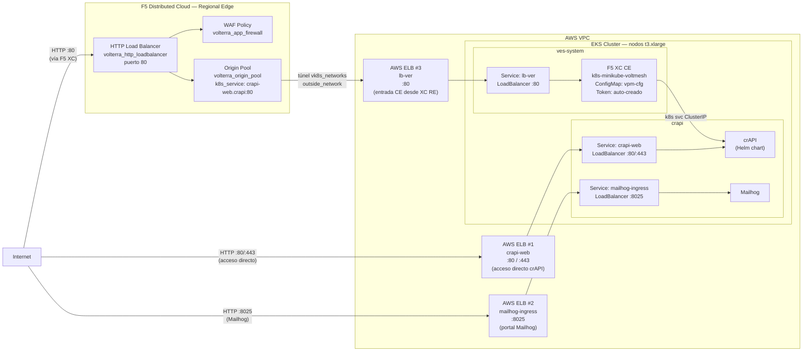

# Seguridad API en RE con CE en EKS — Apply

Este workflow despliega una solución de **seguridad de APIs con F5 Distributed Cloud sobre Regional Edge (RE)**, protegiendo la aplicación **crAPI** (Completely Ridiculous API) que corre en un clúster EKS en AWS. El Customer Edge (CE) se despliega **dentro del propio clúster EKS** como workload de Kubernetes, sin necesidad de una instancia EC2 adicional.

---

## Resumen de arquitectura y caso de uso

### ¿Para qué sirve este laboratorio?

| Capacidad                        | Descripción                                                                                                                            |
| -------------------------------- | -------------------------------------------------------------------------------------------------------------------------------------- |
| CE embebido en EKS               | El Customer Edge de F5 XC corre como pods dentro del clúster EKS (`k8s-minikube-voltmesh`), sin instancias EC2 adicionales.           |
| Origin Pool vía Kubernetes       | El origen se define como un **Kubernetes Service** (`k8s_service`): `crapi-web.crapi` en puerto 80, accedido a través de `vk8s_networks`. |
| Seguridad API en RE              | El tráfico de internet es inspeccionado por el **Regional Edge global de F5 XC**, que actúa como punto de entrada antes de redirigir al CE. |
| WAF integrado                    | `volterra_app_firewall` aplicado en el HTTP Load Balancer. El modo blocking/monitoring se controla con `xc_waf_blocking`.              |
| API Discovery                    | F5 XC puede descubrir y catalogar automáticamente los endpoints de la API de crAPI (activable con `xc_api_disc`).                     |
| Infraestructura efímera          | Todo se provisiona desde cero con Terraform y se destruye con el workflow de destroy.                                                  |
| Estado remoto compartido         | Los cinco workspaces de TFC comparten estado remoto para pasar outputs entre módulos.                                                  |

### Arquitectura conceptual

```
Internet
   │
   │  HTTP :80
   ▼
┌─────────────────────────────────────────────────────────┐
│  F5 Distributed Cloud — Regional Edge (RE) Global        │
│                                                         │
│  • HTTP Load Balancer (puerto 80, http_only = true)     │
│  • WAF Policy (volterra_app_firewall)                   │
│  • Origin Pool: k8s_service → crapi-web.crapi:80        │
│    via CE Site (eks_ce_site = true, k8s_pool = true)    │
└──────────────────────────┬──────────────────────────────┘
                           │  túnel cifrado (vk8s_networks)
                           ▼
┌──────────────────────────────────────────────────────────────────────┐
│  AWS VPC  (infra — 1 VPC, subnets por AZ)                            │
│                                                                      │
│  ┌────────────────────────────────────────────────────────────────┐  │
│  │  EKS Cluster — nodos t3.xlarge                                 │  │
│  │  Endpoint: público + privado                                   │  │
│  │                                                                │  │
│  │  ┌──────────────────────────────────────────────────────────┐  │  │
│  │  │  Namespace: ves-system (F5 XC CE)                        │  │  │
│  │  │  Hardware: k8s-minikube-voltmesh                         │  │  │
│  │  │  ConfigMap: vpm-cfg (ClusterName, Token, Lat/Lon)        │  │  │
│  │  │  Service: lb-ver (LoadBalancer :80) ──► AWS ELB #3       │  │  │
│  │  └──────────────────────────────────────────────────────────┘  │  │
│  │                                                                │  │
│  │  ┌──────────────────────────────────────────────────────────┐  │  │
│  │  │  Namespace: crapi                                        │  │  │
│  │  │  crAPI (Helm) — Completely Ridiculous API                │  │  │
│  │  │  Service: crapi-web (LoadBalancer :80/443) ──► AWS ELB #1│  │  │
│  │  │  Service: mailhog-ingress (LoadBalancer :8025) ► AWS ELB #2│  │  │
│  │  └──────────────────────────────────────────────────────────┘  │  │
│  └────────────────────────────────────────────────────────────────┘  │
│                                                                      │
│  AWS ELB #1 ── crapi-web ──── puerto 80/443 (acceso directo crAPI)   │
│  AWS ELB #2 ── mailhog ────── puerto 8025  (portal Mailhog)          │
│  AWS ELB #3 ── lb-ver ──────── puerto 80   (entrada CE desde XC RE)  │
└──────────────────────────────────────────────────────────────────────┘
```

### Detalles de infraestructura

#### Customer Edge (CE) en EKS

| Parámetro             | Valor                                                                                            |
| --------------------- | ------------------------------------------------------------------------------------------------ |
| Tipo de CE            | **Kubernetes workload** (no EC2) — namespace `ves-system`                                        |
| Hardware certificado  | `k8s-minikube-voltmesh`                                                                          |
| Registro              | Token auto-creado vía API REST de F5 XC + ConfigMap `vpm-cfg` (el secret `XC_CE_TOKEN` es opcional) |
| Geolocalización       | `CE_LATITUDE` / `CE_LONGITUDE` configurados como variables del repositorio                       |
| Endpoint Maurice      | `https://register.ves.volterra.io` / `https://register-tls.ves.volterra.io`                     |
| Tiempo de espera      | Polling de `vp-manager-0` hasta `1/1 Running` + 90s adicionales antes de aprobar el registro en Job 5 |
| Módulo Terraform      | `f5xc-api-ce-eks/eks-cluster/ce-deployment`                                                      |

#### HTTP Load Balancer (F5 XC)

| Parámetro              | Valor                                                          |
| ---------------------- | -------------------------------------------------------------- |
| Tipo                   | HTTP (no HTTPS, no auto-cert — `http_only = true`)             |
| Puerto                 | 80                                                             |
| Modo de advertise      | Regional Edge global de F5 XC (no `advertise_custom`)          |
| WAF Policy             | `volterra_app_firewall` — enforcement mode explícito: `blocking=true` o `monitoring=true` según `xc_waf_blocking` |
| Site de origen         | CE desplegado en EKS (`eks_ce_site = true`, `user_site = true`) |

#### Origin Pool

| Parámetro        | Valor                                                                              |
| ---------------- | ---------------------------------------------------------------------------------- |
| Tipo de servidor | `k8s_service` con `vk8s_networks = true` y `outside_network = true`               |
| Servicio destino | `crapi-web.crapi` (formato: `<service>.<namespace>`)                               |
| Puerto destino   | `80`                                                                               |
| Site locator     | CE Site registrado con `name = PROJECT_PREFIX` en namespace `system`               |
| TLS al origen    | No (`http_only = true`)                                                            |

#### EKS Cluster

| Parámetro             | Valor                                                              |
| --------------------- | ------------------------------------------------------------------ |
| Tipo de instancia     | `t3.xlarge`                                                        |
| Disco                 | 30 GB                                                              |
| Versión EKS           | definida por `var.eks_version`                                     |
| Endpoint access       | Público + Privado (`public_access_cidrs = 0.0.0.0/0`)             |
| Subnets de nodos      | Externas e internas (ambas disponibles)                            |
| Addons                | EBS CSI Driver y otros definidos en `var.eks_addons`               |

#### Networking (VPC)

| Recurso          | Detalle                                                                            |
| ---------------- | ---------------------------------------------------------------------------------- |
| VPC              | 1 VPC (`10.0.0.0/16`), DNS support y hostnames habilitados                         |
| Internet Gateway | 1 IGW adjunto al VPC                                                               |
| Subnets por AZ   | `management`, `internal`, `external`, `app-cidr` y opcionales según variables      |
| Security Groups  | SGs dedicados para el EKS cluster y los worker nodes                               |

### Componentes desplegados

```
f5xc-api-ce-eks/infra  ──►  1 VPC + subnets + IGW + Security Groups
        │
        │  (Remote State: VPC ID, subnet IDs, build suffix)
        ▼
f5xc-api-ce-eks/eks-cluster  ──►  1 EKS Cluster (nodos t3.xlarge, endpoint público+privado)
        │                          IAM roles + addons EBS CSI
        │
        │  (Remote State: cluster name, endpoint, kubeconfig)
        ▼
f5xc-api-ce-eks/crapi-helm  ──►  crAPI (Helm chart) en namespace "crapi"
        │                         AWS ELB #1: crapi-web       (LoadBalancer :80/:443)
        │                         AWS ELB #2: mailhog-ingress (LoadBalancer :8025)
        │
        ▼
f5xc-api-ce-eks/eks-cluster/ce-deployment  ──►  CE como Kubernetes workload (namespace ves-system)
        │                                         ConfigMap: vpm-cfg (k8s-minikube-voltmesh)
        │                                         AWS ELB #3: lb-ver (LoadBalancer :80) — entrada CE
        │                                         sleep 180 + terraform apply -target (registro automático)
        │
        ▼
f5xc-api-ce-eks/xc  ──►  volterra_origin_pool (k8s_service: crapi-web.crapi:80)
                           volterra_http_loadbalancer (puerto 80, RE global)
                           volterra_app_firewall (WAF policy)
```

### Casos de uso típicos

1. Demostración de seguridad de APIs sobre RE con CE embebido en EKS, sin infraestructura adicional.
2. Protección de APIs REST de crAPI con WAF y API Discovery de F5 Distributed Cloud.
3. Laboratorio de detección de vulnerabilidades OWASP API Security Top 10 en un entorno controlado.
4. Validación de políticas de seguridad de APIs en modo detección o bloqueo, antes de aplicarlas en producción.
5. Entorno de pruebas efímero para workshops y capacitaciones de F5 XC sobre EKS en AWS.

---

## Objetivo del workflow

1. Crear (o verificar) los cinco workspaces de Terraform Cloud con modo de ejecución `local` y Remote State Sharing habilitado.
2. Aprovisionar la infraestructura de red en AWS: VPC, subnets, IGW y Security Groups.
3. Desplegar el clúster EKS en AWS.
4. Desplegar la aplicación **crAPI** en EKS usando un Helm chart en el namespace `crapi`.
5. Instalar el **Customer Edge de F5 XC como workload de Kubernetes** en el namespace `ves-system`, con registro automático usando un token pre-generado.
6. Configurar en F5 Distributed Cloud el HTTP Load Balancer con WAF, apuntando al servicio `crapi-web.crapi` a través del CE registrado en EKS.

---

## Triggers

```yaml
on:
  workflow_dispatch:
```

Se ejecuta manualmente desde la pestaña **Actions** de GitHub. No tiene inputs opcionales; toda la configuración proviene de secretos y variables del repositorio.

---

## Secretos requeridos

Configurar en **Settings → Secrets and variables → Secrets**:

### Terraform Cloud

| Secreto                 | Descripción                                  |
| ----------------------- | -------------------------------------------- |
| `TF_API_TOKEN`          | Token de API de Terraform Cloud              |
| `TF_CLOUD_ORGANIZATION` | Nombre de la organización en Terraform Cloud |

### AWS

| Secreto          | Descripción           |
| ---------------- | --------------------- |
| `AWS_ACCESS_KEY` | AWS Access Key ID     |
| `AWS_SECRET_KEY` | AWS Secret Access Key |

### F5 Distributed Cloud

| Secreto           | Descripción                                                             |
| ----------------- | ----------------------------------------------------------------------- |
| `XC_TENANT`       | Nombre del tenant de F5 XC (sin `.console.ves.volterra.io`)             |
| `XC_API_URL`      | URL de la API de F5 XC (`https://<tenant>.console.ves.volterra.io/api`) |
| `XC_P12_PASSWORD` | Contraseña del certificado `.p12` de F5 XC                              |
| `XC_API_P12_FILE` | Certificado API de F5 XC en formato `.p12` codificado en **base64**     |
| `XC_CE_TOKEN`     | *(Opcional)* Token de pre-registro del CE. **Si no se configura, el workflow lo crea automáticamente** via la API REST de F5 XC usando las credenciales `XC_API_P12_FILE` / `XC_P12_PASSWORD`. El token se llama `${PROJECT_PREFIX}-ce-token` y se elimina al final del destroy. |

### Chatbot (opcional)

| Secreto           | Descripción                                                             |
| ----------------- | ----------------------------------------------------------------------- |
| `OPENAI_API_KEY`  | API key de OpenAI para el chatbot de crAPI. Si se configura, el chatbot se habilita automáticamente. Si no, el chatbot permanece desactivado. |

### SSH

| Secreto           | Descripción                                                                                    |
| ----------------- | ---------------------------------------------------------------------------------------------- |
| `SSH_PRIVATE_KEY` | Llave privada SSH (la pública se deriva en runtime con `ssh-keygen -y`). Usada en nodos EKS.  |

---

## Variables requeridas

Configurar en **Settings → Secrets and variables → Variables**:

### Terraform Cloud — Workspaces

| Variable                    | Ejemplo                  | Descripción                                          |
| --------------------------- | ------------------------ | ---------------------------------------------------- |
| `TF_CLOUD_WORKSPACE_INFRA`  | `api-ce-eks-infra`       | Nombre del workspace de TFC para AWS Infra           |
| `TF_CLOUD_WORKSPACE_EKS`    | `api-ce-eks-cluster`     | Nombre del workspace de TFC para EKS Cluster         |
| `TF_CLOUD_WORKSPACE_CRAPI`  | `api-ce-eks-crapi`       | Nombre del workspace de TFC para crAPI App           |
| `TF_CLOUD_WORKSPACE_CE`     | `api-ce-eks-ce`          | Nombre del workspace de TFC para F5 XC CE            |
| `TF_CLOUD_WORKSPACE_XC`     | `api-ce-eks-xc`          | Nombre del workspace de TFC para F5 XC API Security  |

### Infraestructura AWS

| Variable         | Ejemplo                             | Descripción                                     |
| ---------------- | ----------------------------------- | ----------------------------------------------- |
| `AWS_REGION`     | `us-east-1`                         | Región de AWS donde se despliegan los recursos  |
| `AZS`            | `["us-east-1a","us-east-1b"]`       | Zonas de disponibilidad en formato JSON list     |
| `PROJECT_PREFIX` | `api-ce-eks`                        | Prefijo para nombrar todos los recursos creados  |

### F5 Distributed Cloud

| Variable         | Ejemplo                              | Descripción                                            |
| ---------------- | ------------------------------------ | ------------------------------------------------------ |
| `XC_NAMESPACE`   | `crapi-prod`                         | Namespace de F5 XC donde se crea el LB y WAF           |
| `CRAPI_DOMAIN`   | `crapi.prod.example.com`             | FQDN de la aplicación en el HTTP LB de F5 XC           |
| `CE_LATITUDE`    | `37.3861`                            | Latitud geográfica para el registro del CE Site en XC  |
| `CE_LONGITUDE`   | `-122.0839`                          | Longitud geográfica para el registro del CE Site en XC |

---

## Jobs principales

### `setup_tfc_workspaces`

Crea o actualiza los cinco workspaces en Terraform Cloud vía la API REST:

- Execution Mode: **local** (el runner de GitHub ejecuta Terraform).
- Remote State Sharing habilitado con las siguientes relaciones:
  - `INFRA` comparte estado con `EKS`, `CRAPI`, `CE` y `XC`.
  - `EKS` comparte estado con `CRAPI`, `CE` y `XC`.

### `terraform_infra` — AWS Infra

- **Módulo:** `f5xc-api-ce-eks/infra`
- **Workspace TFC:** `TF_CLOUD_WORKSPACE_INFRA`
- **Qué crea:**
  - 1 VPC con DNS support y hostnames habilitados.
  - Internet Gateway adjunto al VPC.
  - Subnets por cada AZ configurada en `AZS`.
  - Security Groups dedicados para EKS cluster y worker nodes.
- **Parámetros fijos en el job:**
  - `TF_VAR_nap = "false"` — sin NGINX App Protect.
  - `TF_VAR_nic = "false"` — sin NGINX Ingress Controller.
  - `TF_VAR_bigip = "false"` — sin BIG-IP.
- **Step especial:** deriva la clave pública SSH de la privada con `ssh-keygen -y` e inyecta como `TF_VAR_ssh_key`.

### `terraform_eks` — AWS EKS

- **Módulo:** `f5xc-api-ce-eks/eks-cluster`
- **Workspace TFC:** `TF_CLOUD_WORKSPACE_EKS`
- **Qué crea:**
  - 1 clúster EKS con endpoint público + privado (`public_access_cidrs = 0.0.0.0/0`).
  - Node group con instancias `t3.xlarge`, disco 30 GB.
  - IAM roles para el cluster y los worker nodes con las políticas necesarias (`AmazonEKSWorkerNodePolicy`, `AmazonEKS_CNI_Policy`, `AmazonEC2ContainerRegistryReadOnly`).
  - Addons EKS definidos en `var.eks_addons`.
- **Step especial:** deriva la clave pública SSH de la privada con `ssh-keygen -y`.

### `terraform_crapi` — crAPI App (Helm)

- **Módulo:** `f5xc-api-ce-eks/crapi-helm`
- **Workspace TFC:** `TF_CLOUD_WORKSPACE_CRAPI`
- **Qué crea:**
  - Release de Helm `crapi` en namespace `crapi` (creado automáticamente) usando el chart local `./helm`.
  - La app crAPI expone el servicio `crapi-web` en puerto `80` dentro del namespace `crapi`.
- **Dependencias de estado remoto:** lee VPC/subnets de `INFRA` y kubeconfig del cluster de `EKS`.
- **Steps especiales post-apply:**
  1. Espera a que el deployment `crapi-identity` esté `Ready` con `kubectl rollout status`.
  2. Crea el usuario `admin@example.com` / `Admin!123` en crAPI vía el ELB directo. Este usuario es requerido por el **MCP server** del chatbot para autenticarse con crAPI al arrancar. Sin él, el MCP server falla silenciosamente en background y el chatbot responde `unhandled errors in a TaskGroup` en cada pregunta.
  3. Reinicia el deployment `crapi-chatbot` para asegurar que el MCP server arranque con el usuario ya disponible.

### `terraform_ce` — F5 XC CE en EKS

- **Módulo:** `f5xc-api-ce-eks/eks-cluster/ce-deployment`
- **Workspace TFC:** `TF_CLOUD_WORKSPACE_CE`
- **Qué crea:**
  - ConfigMap `vpm-cfg` en el namespace `ves-system` con los parámetros de registro del CE:
    - `ClusterName`: valor de `PROJECT_PREFIX`.
    - `CertifiedHardware`: `k8s-minikube-voltmesh`.
    - `Latitude` / `Longitude`: coordenadas del CE Site.
    - `Token`: token de pre-registro del CE (auto-creado o proveniente del secret `XC_CE_TOKEN`).
    - `SkipStages`: omite fases de SO no aplicables en Kubernetes.
  - El CE arranca como pods de Kubernetes en el namespace `ves-system` y se registra automáticamente con F5 XC usando el token.
- **Steps especiales:**
  1. **Create F5 XC Site Token** — si el secret `XC_CE_TOKEN` está configurado, lo usa directamente. Si no, decodifica `XC_API_P12_FILE` con `openssl`, llama a `GET /register/namespaces/system/tokens/${PROJECT_PREFIX}-ce-token` para reutilizar uno existente o `POST` para crear uno nuevo. El valor se exporta como variable de entorno para el step siguiente.
  2. Genera `configmap.tf` dinámicamente con los valores obtenidos, seguido de `terraform fmt`.

### `terraform_xc` — F5 XC API Security

- **Módulo:** `f5xc-api-ce-eks/xc`
- **Workspace TFC:** `TF_CLOUD_WORKSPACE_XC`
- **Qué crea / configura:**
  - 1 Origin Pool (`volterra_origin_pool`) tipo `k8s_service` → `crapi-web.crapi` en puerto `80`, con `vk8s_networks = true` y `outside_network = true`, apuntando al CE Site registrado en EKS.
  - 1 HTTP Load Balancer (`volterra_http_loadbalancer`) en puerto 80 publicado en el **Regional Edge global** de F5 XC (no `advertise_custom`).
  - 1 WAF Policy (`volterra_app_firewall`) vinculada al HTTP LB.
- **Flujo de steps especiales:**
  1. **Configure kubectl** — conecta al cluster EKS descubriéndolo por prefijo con `aws eks list-clusters`.
  2. **Wait for vp-manager-0** — pollea hasta que `vp-manager-0` esté `1/1 Running` (máx. 10 min), luego espera 90s adicionales para que la registration llegue a F5 XC. Reemplaza el anterior `sleep 180` fijo que fallaba cuando el arranque era más lento o más rápido que ese tiempo.
  3. **Approve CE Registration (force replace)** — ejecuta `terraform apply -replace=volterra_registration_approval.k8s-ce[0]` con `-target`. El flag `-replace` es crítico: fuerza a Terraform a re-ejecutar el approval en cada workflow run, incluso cuando el recurso ya existe en el estado de Terraform Cloud. Sin él, en re-ejecuciones el CE nuevo queda en `PENDING` indefinidamente porque Terraform cree que ya fue aprobado.
  4. **Wait for CE to be ONLINE** — pollea hasta que `ver-0` esté `Running` con todos los containers listos (máx. 20 min, 40 intentos cada 30s). Falla con `exit 1` y muestra diagnóstico si el CE no llega a Online.
  5. `terraform plan` + `terraform apply -auto-approve` completo — crea el Load Balancer, WAF y Origin Pool una vez el CE está ONLINE.
- **Parámetros fijos en el job:**

  | Variable Terraform      | Valor              | Propósito                                                          |
  | ----------------------- | ------------------ | ------------------------------------------------------------------ |
  | `TF_VAR_eks_ce_site`    | `"true"`           | Indica que el CE está desplegado en EKS (k8s-minikube-voltmesh)   |
  | `TF_VAR_k8s_pool`       | `"true"`           | Origin pool tipo `k8s_service` en lugar de IP privada              |
  | `TF_VAR_serviceName`    | `"crapi-web.crapi"` | Nombre del servicio Kubernetes destino (`<svc>.<namespace>`)       |
  | `TF_VAR_serviceport`    | `"80"`             | Puerto del servicio Kubernetes                                     |
  | `TF_VAR_site_name`      | `PROJECT_PREFIX`   | Nombre del CE Site registrado en F5 XC                             |
  | `TF_VAR_user_site`      | `"true"`           | El site es del tenant del usuario (no `ves-io`)                    |
  | `TF_VAR_http_only`      | `"true"`           | HTTP puerto 80 (sin HTTPS, sin auto-cert, sin delegación DNS)      |

- **Backend TFC:** el P12 se decodifica de base64 directamente a `api.p12` en el step de backend:
  ```bash
  echo "${{ secrets.XC_API_P12_FILE }}" | base64 -d > api.p12
  ```

### `show_endpoints` — Resumen de endpoints

- **Sin workspace TFC** — solo usa AWS CLI y `kubectl`, no ejecuta Terraform.
- **Qué hace:**
  - Descubre el nombre del clúster EKS buscando por prefijo (`PROJECT_PREFIX`) con `aws eks list-clusters`.
  - Actualiza el kubeconfig con `aws eks update-kubeconfig`.
  - Consulta el `EXTERNAL-IP` de los servicios `crapi-web` y `mailhog-ingress` en el namespace `crapi`.
  - Resuelve el `CRAPI_DOMAIN` a IP con `dig +short` para confirmar que el DNS apunta al Regional Edge de F5 XC.
  - Imprime un resumen formateado con todos los endpoints de acceso.
- **Output de ejemplo:**
  ```
  ╔══════════════════════════════════════════════════════════════╗
  ║              DEPLOYMENT ENDPOINTS SUMMARY                   ║
  ╠══════════════════════════════════════════════════════════════╣
  ║ CRAPI_DOMAIN  : crapi.digitalvs.com
  ║ CRAPI_DOMAIN IP (DNS): 5.182.x.x
  ╠══════════════════════════════════════════════════════════════╣
  ║ ELB #1 — crapi-web (acceso directo :80/:443)
  ║   abc123.us-east-1.elb.amazonaws.com
  ╠══════════════════════════════════════════════════════════════╣
  ║ ELB #2 — mailhog-ingress (portal Mailhog :8025)
  ║   def456.us-east-1.elb.amazonaws.com
  ╠══════════════════════════════════════════════════════════════╣
  ║ URLs de acceso:
  ║   crAPI (via F5 XC RE) : http://crapi.digitalvs.com
  ║   crAPI (directo)      : http://abc123.us-east-1.elb.amazonaws.com
  ║   Mailhog              : http://def456.us-east-1.elb.amazonaws.com:8025
  ╚══════════════════════════════════════════════════════════════╝
  ```

---

## Arquitectura desplegada por el workflow



### AWS Load Balancers creados automáticamente

EKS provisiona un AWS Classic Load Balancer por cada servicio Kubernetes de tipo `LoadBalancer`. Este workflow crea **3 ELBs** en total:

| # | Nombre en K8s | Namespace | Puertos | Origen | Uso |
|---|---------------|-----------|---------|--------|----- |
| 1 | `crapi-web` | `crapi` | 80, 443 | `web/ingress.yaml` (Helm chart) | Acceso directo a crAPI, sin pasar por F5 XC |
| 2 | `mailhog-ingress` | `crapi` | 8025 | `mailhog/ingress.yaml` (Helm chart) | Portal web de Mailhog para captura de emails |
| 3 | `lb-ver` | `ves-system` | 80 | `ce-k8s-lb.tf` (Terraform CE) | Punto de entrada del CE para el tráfico desde el Regional Edge de F5 XC |

> **Nota:** El tráfico de producción que pasa por F5 XC llega a crAPI a través del ELB #3 (`lb-ver` → CE → ClusterIP `crapi-web`), **no** a través del ELB #1. El ELB #1 es un acceso directo alternativo sin WAF ni inspección de F5 XC.

---

## Troubleshooting rápido

- **El CE Site queda en `PENDING` / `REGISTERING` indefinidamente:**
  El workflow aprueba el registro automáticamente usando `terraform apply -replace=volterra_registration_approval.k8s-ce[0]` (con `-target`). El flag `-replace` es obligatorio para forzar la re-aprobación en cada ejecución; sin él, Terraform omite el paso si el recurso ya existe en el estado de TFC.
  Si persiste tras un re-run del workflow, verificar:
  - Que el step **Create F5 XC Site Token** (Job 4) haya completado correctamente. Si el secret `XC_CE_TOKEN` no está configurado, el token se crea automáticamente via API. Verificar los logs del step para confirmar que el token fue obtenido o creado. Si falló, revisar que `XC_API_P12_FILE` y `XC_P12_PASSWORD` sean correctos, o crear el token manualmente en la consola de F5 XC (*Multi-Cloud Network Connect → Manage → Site Management → Site Tokens*) y guardarlo como secret `XC_CE_TOKEN`.
  - Que `vp-manager-0` esté `1/1 Running` en el namespace `ves-system` (`kubectl get pods -n ves-system`).
  - Los logs de `vp-manager-0` para ver el estado de la registration (`kubectl logs vp-manager-0 -n ves-system --tail=20`).

- **Error al decodificar `XC_API_P12_FILE`:**
  Confirmar que el archivo esté correctamente codificado en base64:
  ```bash
  base64 -i api.p12 | pbcopy   # macOS
  base64 api.p12 | xclip       # Linux
  ```

- **El job `terraform_xc` falla con `site not found`:**
  El CE necesita estar completamente registrado y ONLINE antes de que Terraform configure el LB. El workflow pollea `ver-0` hasta que esté Running (máx. 20 min) antes del apply completo. Si falla igualmente, re-ejecutar el workflow completo — el paso de approval tiene `-replace` que fuerza la re-aprobación aunque el CE sea nuevo.

- **`crapi-web` no responde en puerto 80:**
  Verificar que el Helm release se haya aplicado correctamente:
  ```bash
  kubectl get pods -n crapi
  kubectl get svc -n crapi
  ```

- **Error `hostname not in correct format` en `setup_tfc_workspaces`:**
  Verificar que el secreto `TF_CLOUD_ORGANIZATION` esté correctamente configurado y no esté vacío.

- **El configmap.tf generado dinámicamente falla `terraform validate`:**
  Revisar el output del step `Terraform fmt` en el job `terraform_ce`: el archivo se imprime con `cat configmap.tf` antes del validate, lo que permite identificar problemas de interpolación.

- **El Origin Pool no puede alcanzar el servicio `crapi-web.crapi`:**
  Confirmar que `TF_VAR_site_name` coincide exactamente con el nombre del CE Site registrado en F5 XC (`PROJECT_PREFIX`). El site locator usa `namespace = "system"` y `tenant = null` (tenant del usuario, no ves-io).

- **El enforcement mode del WAF aparece sin seleccionar en la consola de F5 XC:**
  Ocurre si el recurso `volterra_app_firewall` usa `use_loadbalancer_setting = true`, que delega el modo al LB y XC lo muestra en blanco. El fix ya está aplicado: el WAF define explícitamente `blocking = tobool(var.xc_waf_blocking)` y `monitoring = !tobool(var.xc_waf_blocking)`. Con el valor por defecto (`xc_waf_blocking = "false"`) el modo es **Monitoring**. Para activar **Blocking**, pasar `TF_VAR_xc_waf_blocking=true` en el job `terraform_xc`.

- **El workflow de destroy no elimina el VPC (error: dependencias activas):**
  Los ELBs creados por Kubernetes (`crapi-web`, `mailhog-ingress`, `lb-ver`) no son gestionados por Terraform y quedan activos dentro del VPC bloqueando su eliminación. El workflow de destroy ya incluye un step previo al destroy del cluster EKS que:
  1. Descubre el cluster por prefijo y actualiza el kubeconfig.
  2. Ejecuta `kubectl delete svc crapi-web mailhog-ingress -n crapi` y `kubectl delete svc lb-ver -n ves-system`.
  3. Elimina el secret `crapi-chatbot-secret` si existe.
  4. Espera 60 segundos para que AWS elimine los ELBs antes de continuar con `terraform destroy`.

- **El chatbot queda en `CrashLoopBackOff`:**
  La imagen `crapi/crapi-chatbot` usa la variable `SERVER_PORT` (no `PORT`) para arrancar uvicorn. Si el pod falla, verificar con:
  ```bash
  kubectl logs -n crapi -l app=crapi-chatbot --tail=5
  ```
  El Helm chart ya define `SERVER_PORT` correctamente. Si ocurre en el clúster actual sin re-deploy:
  ```bash
  kubectl set env deployment/crapi-chatbot -n crapi SERVER_PORT=9999
  ```

- **"Could not connect to mechanic api" en la UI de crAPI:**
  El endpoint del mecánico hace un callback a `CRAPI_DOMAIN`. Verificar que el dominio tenga un registro DNS público activo apuntando al Regional Edge de F5 XC. Sin DNS público, los pods del clúster no pueden resolver el dominio y el callback falla.

---

## Uso de la aplicación crAPI

Una vez que el workflow finaliza correctamente, la aplicación crAPI queda expuesta en la URL configurada en `CRAPI_DOMAIN` (por ejemplo, `http://crapi.digitalvs.com`).

### Registro e inicio de sesión

1. **Crear una cuenta** enviando un POST al endpoint de registro:
   ```bash
   curl -s -X POST http://<CRAPI_DOMAIN>/identity/api/auth/signup \
     -H "Content-Type: application/json" \
     -d '{"email":"usuario@ejemplo.com","name":"Nombre Apellido","password":"Password123!","number":"1234567890"}'
   ```
   La respuesta incluye un mensaje de verificación. crAPI envía un email de confirmación interno.

2. **Verificar la cuenta con Mailhog:**
   Mailhog captura todos los emails enviados por crAPI (verificación de cuenta, reset de contraseña, etc.).

   > **¿Por qué no funciona `http://<CRAPI_DOMAIN>:8025`?**
   > `CRAPI_DOMAIN` (p.ej. `crapi.digitalvs.com`) apunta al **Regional Edge de F5 XC**, que solo tiene configurado un HTTP Load Balancer en el **puerto 80**. El puerto 8025 no existe en F5 XC y el tráfico es descartado.
   > Mailhog queda expuesto directamente via un **AWS ELB propio**, provisionado por Kubernetes al crear el servicio de tipo `LoadBalancer` en el namespace `crapi`. Este ELB es independiente de F5 XC.

   Para obtener la URL de Mailhog, primero actualizar el kubeconfig y luego consultar el servicio:
   ```bash
   aws eks update-kubeconfig --region <AWS_REGION> --name <cluster-name>
   kubectl get svc -n crapi mailhog
   ```
   La columna `EXTERNAL-IP` muestra el hostname del ELB de AWS. Ejemplo de output:
   ```
   NAME      TYPE           CLUSTER-IP     EXTERNAL-IP                                                               PORT(S)          AGE
   mailhog   LoadBalancer   172.20.x.x     aa739714051cd421f9652bed09553419-1867348507.us-east-1.elb.amazonaws.com   8025:32xxx/TCP   5m
   ```
   Abrir `http://<EXTERNAL-IP>:8025` en el navegador, buscar el email de verificación y hacer clic en el enlace de confirmación.

   ```
   Internet → crapi.digitalvs.com:80 → F5 XC RE → CE → crapi-web:80   ✅ (pasa por XC)
   Internet → crapi.digitalvs.com:8025 → F5 XC RE → ❌ (no hay LB en ese puerto)
   Internet → <aws-elb>:8025 → AWS ELB → pods mailhog:8025           ✅ (directo, sin XC)
   ```

3. **Iniciar sesión** para obtener el token JWT:
   ```bash
   curl -s -X POST http://<CRAPI_DOMAIN>/identity/api/auth/login \
     -H "Content-Type: application/json" \
     -d '{"email":"usuario@ejemplo.com","password":"Password123!"}' | jq .token
   ```
   Guardar el token para usarlo en las siguientes peticiones como `Bearer <token>`.

### Funcionalidades principales

| Funcionalidad            | Método | Endpoint                                         |
| ------------------------ | ------ | ------------------------------------------------ |
| Registro                 | POST   | `/identity/api/auth/signup`                      |
| Login                    | POST   | `/identity/api/auth/login`                       |
| Perfil de usuario        | GET    | `/identity/api/v2/user/dashboard`                |
| Vehículos del usuario    | GET    | `/identity/api/v2/vehicle/vehicles`              |
| Localización del vehículo| GET    | `/identity/api/v2/vehicle/{vehicleId}/location`  |
| Comunidad (posts)        | GET    | `/community/api/v2/community/posts/recent`       |
| Tienda — productos       | GET    | `/workshop/api/shop/products`                    |
| Tienda — órdenes         | POST   | `/workshop/api/shop/orders`                      |
| Cupones                  | POST   | `/workshop/api/shop/apply_coupon`                |
| Mecánico (contacto)      | POST   | `/workshop/api/mechanic/`                        |

### Interfaz web

crAPI también expone una interfaz web en `http://<CRAPI_DOMAIN>`. Acceder en el navegador, registrar una cuenta (o usar la existente) y explorar el dashboard, el garage virtual y la tienda.

### Chatbot de crAPI

crAPI incluye un chatbot integrado en la interfaz web que utiliza la API de OpenAI. Para habilitarlo:

1. **Configurar el secreto** `OPENAI_API_KEY` en **Settings → Secrets and variables → Actions → Secrets** con tu API key de OpenAI (formato `sk-...`).

2. El workflow lo detecta automáticamente y habilita el servicio `crapi-chatbot` durante el deploy de Job 3. Si el secreto no está configurado, el chatbot permanece desactivado.

3. Una vez desplegado, el chatbot aparece en la interfaz web de crAPI. Al iniciar sesión, el icono de chat en la esquina inferior permite abrir la conversación directamente sin necesidad de introducir la API key manualmente.

> **Nota de seguridad:** El secreto `OPENAI_API_KEY` se inyecta a través de un Kubernetes Secret (`crapi-chatbot-secret`) creado por el Helm chart. No queda expuesto en los logs del workflow ni en el estado de Terraform Cloud.

#### Arquitectura interna del chatbot

El pod `crapi-chatbot` ejecuta **dos procesos en el mismo contenedor**:

| Proceso | Puerto | Descripción |
|---------|--------|-------------|
| `uvicorn chatbot.app:app` | `9999` | API principal del chatbot (expuesta via Kubernetes Service) |
| `python -m mcpserver.server` | `5500` | MCP server interno — provee herramientas de crAPI al agente LangGraph |

El MCP server se comunica con `crapi-identity` al arrancar para obtener un API key usando el usuario `admin@example.com` / `Admin!123`. El workflow crea este usuario automáticamente en el Job 3 (`crAPI App`) tras el deploy del Helm chart.

> **Si el chatbot responde `unhandled errors in a TaskGroup`:** el MCP server no pudo autenticarse con crAPI y terminó. Verificar que el usuario `admin@example.com` exista en crAPI y reiniciar el pod:
> ```bash
> kubectl rollout restart deployment/crapi-chatbot -n crapi
> ```

### Vulnerabilidades OWASP API Security Top 10

crAPI está diseñada deliberadamente con vulnerabilidades para fines de laboratorio. Algunos ejemplos verificables:

| ID      | Vulnerabilidad                    | Descripción breve                                                            |
| ------- | --------------------------------- | ---------------------------------------------------------------------------- |
| API1    | Broken Object Level Authorization | Acceder a la ubicación del vehículo de otro usuario usando su `vehicleId`    |
| API2    | Broken Authentication             | Fuerza bruta al endpoint de OTP (`/identity/api/auth/v3/check-otp`)         |
| API3    | Broken Object Property Auth       | Modificar propiedades no permitidas del perfil de usuario                    |
| API5    | Broken Function Level Auth        | Acceder a la API de mecánicos como usuario normal                            |
| API8    | Security Misconfiguration         | Endpoint de video expone objeto completo sin filtrar                          |

> **Nota:** Este laboratorio es un entorno controlado. Las vulnerabilidades existen intencionalmente para demostración y aprendizaje con F5 XC API Security (API Discovery, WAF, rate limiting).

---

## Ejecución manual

1. Ir a **Actions** en GitHub.
2. Seleccionar el workflow: **Seguridad API en RE para EKS con CE**.
3. Hacer clic en **Run workflow**.
4. Confirmar en la rama `main` (o la rama configurada).
5. Monitorear el progreso: los 6 jobs se ejecutan en secuencia:
   - **Job 0** (`setup_tfc_workspaces`): crea workspaces TFC y configura Remote State Sharing.
   - **Jobs 1–2** (`terraform_infra`, `terraform_eks`): VPC, subnets, EKS cluster.
   - **Job 3** (`terraform_crapi`): despliega crAPI con Helm, crea el usuario MCP admin y reinicia el chatbot.
   - **Job 4** (`terraform_ce`): instala el CE como workload en EKS.
   - **Job 5** (`terraform_xc`): pollea `vp-manager-0`, aprueba el registro del CE con `-replace`, espera hasta 20 min a que `ver-0` esté Online, y crea el Load Balancer + WAF en F5 XC.
   - **Job 6** (`show_endpoints`): imprime las URLs de acceso finales (CRAPI_DOMAIN + ELBs de AWS) directamente en el log del workflow.
