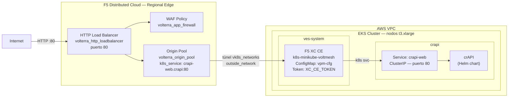

# Seguridad API en RE con CE en EKS — Apply

Este workflow despliega una solución de **seguridad de APIs con F5 Distributed Cloud sobre Regional Edge (RE)**, protegiendo la aplicación **crAPI** (Completely Ridiculous API) que corre en un clúster EKS en AWS. El Customer Edge (CE) se despliega **dentro del propio clúster EKS** como workload de Kubernetes, sin necesidad de una instancia EC2 adicional.

---

## Resumen de arquitectura y caso de uso

### ¿Para qué sirve este laboratorio?

| Capacidad                        | Descripción                                                                                                                            |
| -------------------------------- | -------------------------------------------------------------------------------------------------------------------------------------- |
| CE embebido en EKS               | El Customer Edge de F5 XC corre como pods dentro del clúster EKS (`k8s-minikube-voltmesh`), sin instancias EC2 adicionales.           |
| Origin Pool vía Kubernetes       | El origen se define como un **Kubernetes Service** (`k8s_service`): `crapi-web.crapi` en puerto 80, accedido a través de `vk8s_networks`. |
| Seguridad API en RE              | El tráfico de internet es inspeccionado por el **Regional Edge global de F5 XC**, que actúa como punto de entrada antes de redirigir al CE. |
| WAF integrado                    | `volterra_app_firewall` aplicado en el HTTP Load Balancer. El modo blocking/monitoring se controla con `xc_waf_blocking`.              |
| API Discovery                    | F5 XC puede descubrir y catalogar automáticamente los endpoints de la API de crAPI (activable con `xc_api_disc`).                     |
| Infraestructura efímera          | Todo se provisiona desde cero con Terraform y se destruye con el workflow de destroy.                                                  |
| Estado remoto compartido         | Los cinco workspaces de TFC comparten estado remoto para pasar outputs entre módulos.                                                  |

### Arquitectura conceptual

```
Internet
   │
   │  HTTP :80
   ▼
┌─────────────────────────────────────────────────────────┐
│  F5 Distributed Cloud — Regional Edge (RE) Global        │
│                                                         │
│  • HTTP Load Balancer (puerto 80, http_only = true)     │
│  • WAF Policy (volterra_app_firewall)                   │
│  • Origin Pool: k8s_service → crapi-web.crapi:80        │
│    via CE Site (eks_ce_site = true, k8s_pool = true)    │
└──────────────────────────┬──────────────────────────────┘
                           │  túnel cifrado (vk8s_networks)
                           ▼
┌──────────────────────────────────────────────────────────────────────┐
│  AWS VPC  (infra — 1 VPC, subnets por AZ)                            │
│                                                                      │
│  ┌────────────────────────────────────────────────────────────────┐  │
│  │  EKS Cluster — nodos t3.xlarge                                 │  │
│  │  Endpoint: público + privado                                   │  │
│  │                                                                │  │
│  │  ┌──────────────────────────────────────────────────────────┐  │  │
│  │  │  Namespace: ves-system (F5 XC CE)                        │  │  │
│  │  │  Hardware: k8s-minikube-voltmesh                         │  │  │
│  │  │  ConfigMap: vpm-cfg (ClusterName, Token, Lat/Lon)        │  │  │
│  │  └──────────────────────────────────────────────────────────┘  │  │
│  │                                                                │  │
│  │  ┌──────────────────────────────────────────────────────────┐  │  │
│  │  │  Namespace: crapi                                        │  │  │
│  │  │  crAPI (Helm) — Completely Ridiculous API                │  │  │
│  │  │  Service: crapi-web (ClusterIP, puerto 80)               │  │  │
│  │  └──────────────────────────────────────────────────────────┘  │  │
│  └────────────────────────────────────────────────────────────────┘  │
└──────────────────────────────────────────────────────────────────────┘
```

### Detalles de infraestructura

#### Customer Edge (CE) en EKS

| Parámetro             | Valor                                                                                            |
| --------------------- | ------------------------------------------------------------------------------------------------ |
| Tipo de CE            | **Kubernetes workload** (no EC2) — namespace `ves-system`                                        |
| Hardware certificado  | `k8s-minikube-voltmesh`                                                                          |
| Registro              | Token pre-generado (`XC_CE_TOKEN`) + ConfigMap `vpm-cfg`                                        |
| Geolocalización       | `CE_LATITUDE` / `CE_LONGITUDE` configurados como variables del repositorio                       |
| Endpoint Maurice      | `https://register.ves.volterra.io` / `https://register-tls.ves.volterra.io`                     |
| Tiempo de espera      | **12 minutos** (`sleep 720`) tras el apply de CE para que los pods arranquen y se registren en XC |
| Módulo Terraform      | `f5xc-api-ce-eks/eks-cluster/ce-deployment`                                                      |

#### HTTP Load Balancer (F5 XC)

| Parámetro              | Valor                                                          |
| ---------------------- | -------------------------------------------------------------- |
| Tipo                   | HTTP (no HTTPS, no auto-cert — `http_only = true`)             |
| Puerto                 | 80                                                             |
| Modo de advertise      | Regional Edge global de F5 XC (no `advertise_custom`)          |
| WAF Policy             | `volterra_app_firewall` — modo configurable (`xc_waf_blocking`) |
| Site de origen         | CE desplegado en EKS (`eks_ce_site = true`, `user_site = true`) |

#### Origin Pool

| Parámetro        | Valor                                                                              |
| ---------------- | ---------------------------------------------------------------------------------- |
| Tipo de servidor | `k8s_service` con `vk8s_networks = true` y `outside_network = true`               |
| Servicio destino | `crapi-web.crapi` (formato: `<service>.<namespace>`)                               |
| Puerto destino   | `80`                                                                               |
| Site locator     | CE Site registrado con `name = PROJECT_PREFIX` en namespace `system`               |
| TLS al origen    | No (`http_only = true`)                                                            |

#### EKS Cluster

| Parámetro             | Valor                                                              |
| --------------------- | ------------------------------------------------------------------ |
| Tipo de instancia     | `t3.xlarge`                                                        |
| Disco                 | 30 GB                                                              |
| Versión EKS           | definida por `var.eks_version`                                     |
| Endpoint access       | Público + Privado (`public_access_cidrs = 0.0.0.0/0`)             |
| Subnets de nodos      | Externas e internas (ambas disponibles)                            |
| Addons                | EBS CSI Driver y otros definidos en `var.eks_addons`               |

#### Networking (VPC)

| Recurso          | Detalle                                                                            |
| ---------------- | ---------------------------------------------------------------------------------- |
| VPC              | 1 VPC (`10.0.0.0/16`), DNS support y hostnames habilitados                         |
| Internet Gateway | 1 IGW adjunto al VPC                                                               |
| Subnets por AZ   | `management`, `internal`, `external`, `app-cidr` y opcionales según variables      |
| Security Groups  | SGs dedicados para el EKS cluster y los worker nodes                               |

### Componentes desplegados

```
f5xc-api-ce-eks/infra  ──►  1 VPC + subnets + IGW + Security Groups
        │
        │  (Remote State: VPC ID, subnet IDs, build suffix)
        ▼
f5xc-api-ce-eks/eks-cluster  ──►  1 EKS Cluster (nodos t3.xlarge, endpoint público+privado)
        │                          IAM roles + addons EBS CSI
        │
        │  (Remote State: cluster name, endpoint, kubeconfig)
        ▼
f5xc-api-ce-eks/crapi-helm  ──►  crAPI (Helm chart) en namespace "crapi"
        │                         Service: crapi-web (ClusterIP, puerto 80)
        │
        ▼
f5xc-api-ce-eks/eks-cluster/ce-deployment  ──►  CE como Kubernetes workload (namespace ves-system)
        │                                         ConfigMap: vpm-cfg (k8s-minikube-voltmesh)
        │                                         Espera 12 minutos para registro en F5 XC
        │
        ▼
f5xc-api-ce-eks/xc  ──►  volterra_origin_pool (k8s_service: crapi-web.crapi:80)
                           volterra_http_loadbalancer (puerto 80, RE global)
                           volterra_app_firewall (WAF policy)
```

### Casos de uso típicos

1. Demostración de seguridad de APIs sobre RE con CE embebido en EKS, sin infraestructura adicional.
2. Protección de APIs REST de crAPI con WAF y API Discovery de F5 Distributed Cloud.
3. Laboratorio de detección de vulnerabilidades OWASP API Security Top 10 en un entorno controlado.
4. Validación de políticas de seguridad de APIs en modo detección o bloqueo, antes de aplicarlas en producción.
5. Entorno de pruebas efímero para workshops y capacitaciones de F5 XC sobre EKS en AWS.

---

## Objetivo del workflow

1. Crear (o verificar) los cinco workspaces de Terraform Cloud con modo de ejecución `local` y Remote State Sharing habilitado.
2. Aprovisionar la infraestructura de red en AWS: VPC, subnets, IGW y Security Groups.
3. Desplegar el clúster EKS en AWS.
4. Desplegar la aplicación **crAPI** en EKS usando un Helm chart en el namespace `crapi`.
5. Instalar el **Customer Edge de F5 XC como workload de Kubernetes** en el namespace `ves-system`, con registro automático usando un token pre-generado.
6. Configurar en F5 Distributed Cloud el HTTP Load Balancer con WAF, apuntando al servicio `crapi-web.crapi` a través del CE registrado en EKS.

---

## Triggers

```yaml
on:
  workflow_dispatch:
```

Se ejecuta manualmente desde la pestaña **Actions** de GitHub. No tiene inputs opcionales; toda la configuración proviene de secretos y variables del repositorio.

---

## Secretos requeridos

Configurar en **Settings → Secrets and variables → Secrets**:

### Terraform Cloud

| Secreto                 | Descripción                                  |
| ----------------------- | -------------------------------------------- |
| `TF_API_TOKEN`          | Token de API de Terraform Cloud              |
| `TF_CLOUD_ORGANIZATION` | Nombre de la organización en Terraform Cloud |

### AWS

| Secreto          | Descripción           |
| ---------------- | --------------------- |
| `AWS_ACCESS_KEY` | AWS Access Key ID     |
| `AWS_SECRET_KEY` | AWS Secret Access Key |

### F5 Distributed Cloud

| Secreto           | Descripción                                                             |
| ----------------- | ----------------------------------------------------------------------- |
| `XC_TENANT`       | Nombre del tenant de F5 XC (sin `.console.ves.volterra.io`)             |
| `XC_API_URL`      | URL de la API de F5 XC (`https://<tenant>.console.ves.volterra.io/api`) |
| `XC_P12_PASSWORD` | Contraseña del certificado `.p12` de F5 XC                              |
| `XC_API_P12_FILE` | Certificado API de F5 XC en formato `.p12` codificado en **base64**     |
| `XC_CE_TOKEN`     | Token de pre-registro del CE generado en la consola de F5 XC            |

### SSH

| Secreto           | Descripción                                                                                    |
| ----------------- | ---------------------------------------------------------------------------------------------- |
| `SSH_PRIVATE_KEY` | Llave privada SSH (la pública se deriva en runtime con `ssh-keygen -y`). Usada en nodos EKS.  |

---

## Variables requeridas

Configurar en **Settings → Secrets and variables → Variables**:

### Terraform Cloud — Workspaces

| Variable                    | Ejemplo                  | Descripción                                          |
| --------------------------- | ------------------------ | ---------------------------------------------------- |
| `TF_CLOUD_WORKSPACE_INFRA`  | `api-ce-eks-infra`       | Nombre del workspace de TFC para AWS Infra           |
| `TF_CLOUD_WORKSPACE_EKS`    | `api-ce-eks-cluster`     | Nombre del workspace de TFC para EKS Cluster         |
| `TF_CLOUD_WORKSPACE_CRAPI`  | `api-ce-eks-crapi`       | Nombre del workspace de TFC para crAPI App           |
| `TF_CLOUD_WORKSPACE_CE`     | `api-ce-eks-ce`          | Nombre del workspace de TFC para F5 XC CE            |
| `TF_CLOUD_WORKSPACE_XC`     | `api-ce-eks-xc`          | Nombre del workspace de TFC para F5 XC API Security  |

### Infraestructura AWS

| Variable         | Ejemplo                             | Descripción                                     |
| ---------------- | ----------------------------------- | ----------------------------------------------- |
| `AWS_REGION`     | `us-east-1`                         | Región de AWS donde se despliegan los recursos  |
| `AZS`            | `["us-east-1a","us-east-1b"]`       | Zonas de disponibilidad en formato JSON list     |
| `PROJECT_PREFIX` | `api-ce-eks`                        | Prefijo para nombrar todos los recursos creados  |

### F5 Distributed Cloud

| Variable         | Ejemplo                              | Descripción                                            |
| ---------------- | ------------------------------------ | ------------------------------------------------------ |
| `XC_NAMESPACE`   | `crapi-prod`                         | Namespace de F5 XC donde se crea el LB y WAF           |
| `APP_DOMAIN`     | `crapi.prod.example.com`             | FQDN de la aplicación en el HTTP LB de F5 XC           |
| `CE_LATITUDE`    | `37.3861`                            | Latitud geográfica para el registro del CE Site en XC  |
| `CE_LONGITUDE`   | `-122.0839`                          | Longitud geográfica para el registro del CE Site en XC |

---

## Jobs principales

### `setup_tfc_workspaces`

Crea o actualiza los cinco workspaces en Terraform Cloud vía la API REST:

- Execution Mode: **local** (el runner de GitHub ejecuta Terraform).
- Remote State Sharing habilitado con las siguientes relaciones:
  - `INFRA` comparte estado con `EKS`, `CRAPI`, `CE` y `XC`.
  - `EKS` comparte estado con `CRAPI`, `CE` y `XC`.

### `terraform_infra` — AWS Infra

- **Módulo:** `f5xc-api-ce-eks/infra`
- **Workspace TFC:** `TF_CLOUD_WORKSPACE_INFRA`
- **Qué crea:**
  - 1 VPC con DNS support y hostnames habilitados.
  - Internet Gateway adjunto al VPC.
  - Subnets por cada AZ configurada en `AZS`.
  - Security Groups dedicados para EKS cluster y worker nodes.
- **Parámetros fijos en el job:**
  - `TF_VAR_nap = "false"` — sin NGINX App Protect.
  - `TF_VAR_nic = "false"` — sin NGINX Ingress Controller.
  - `TF_VAR_bigip = "false"` — sin BIG-IP.
- **Step especial:** deriva la clave pública SSH de la privada con `ssh-keygen -y` e inyecta como `TF_VAR_ssh_key`.

### `terraform_eks` — AWS EKS

- **Módulo:** `f5xc-api-ce-eks/eks-cluster`
- **Workspace TFC:** `TF_CLOUD_WORKSPACE_EKS`
- **Qué crea:**
  - 1 clúster EKS con endpoint público + privado (`public_access_cidrs = 0.0.0.0/0`).
  - Node group con instancias `t3.xlarge`, disco 30 GB.
  - IAM roles para el cluster y los worker nodes con las políticas necesarias (`AmazonEKSWorkerNodePolicy`, `AmazonEKS_CNI_Policy`, `AmazonEC2ContainerRegistryReadOnly`).
  - Addons EKS definidos en `var.eks_addons`.
- **Step especial:** deriva la clave pública SSH de la privada con `ssh-keygen -y`.

### `terraform_crapi` — crAPI App (Helm)

- **Módulo:** `f5xc-api-ce-eks/crapi-helm`
- **Workspace TFC:** `TF_CLOUD_WORKSPACE_CRAPI`
- **Qué crea:**
  - Release de Helm `crapi` en namespace `crapi` (creado automáticamente) usando el chart local `./helm`.
  - La app crAPI expone el servicio `crapi-web` en puerto `80` dentro del namespace `crapi`.
- **Dependencias de estado remoto:** lee VPC/subnets de `INFRA` y kubeconfig del cluster de `EKS`.

### `terraform_ce` — F5 XC CE en EKS

- **Módulo:** `f5xc-api-ce-eks/eks-cluster/ce-deployment`
- **Workspace TFC:** `TF_CLOUD_WORKSPACE_CE`
- **Qué crea:**
  - ConfigMap `vpm-cfg` en el namespace `ves-system` con los parámetros de registro del CE:
    - `ClusterName`: valor de `PROJECT_PREFIX`.
    - `CertifiedHardware`: `k8s-minikube-voltmesh`.
    - `Latitude` / `Longitude`: coordenadas del CE Site.
    - `Token`: `XC_CE_TOKEN` para el pre-registro en F5 XC.
    - `SkipStages`: omite fases de SO no aplicables en Kubernetes.
  - El CE arranca como pods de Kubernetes en el namespace `ves-system` y se registra automáticamente con F5 XC usando el token.
- **Step especial:** genera el archivo `configmap.tf` dinámicamente en runtime con los valores de los secretos y variables del repositorio, seguido de `terraform fmt` para normalizar el formato.

### `terraform_xc` — F5 XC API Security

- **Módulo:** `f5xc-api-ce-eks/xc`
- **Workspace TFC:** `TF_CLOUD_WORKSPACE_XC`
- **Qué crea / configura:**
  - 1 Origin Pool (`volterra_origin_pool`) tipo `k8s_service` → `crapi-web.crapi` en puerto `80`, con `vk8s_networks = true` y `outside_network = true`, apuntando al CE Site registrado en EKS.
  - 1 HTTP Load Balancer (`volterra_http_loadbalancer`) en puerto 80 publicado en el **Regional Edge global** de F5 XC (no `advertise_custom`).
  - 1 WAF Policy (`volterra_app_firewall`) vinculada al HTTP LB.
- **Step especial:** espera **12 minutos** (`sleep 720`) antes de ejecutar Terraform para dar tiempo a que los pods del CE arranquen y completen el registro con F5 XC.
- **Parámetros fijos en el job:**

  | Variable Terraform      | Valor              | Propósito                                                          |
  | ----------------------- | ------------------ | ------------------------------------------------------------------ |
  | `TF_VAR_eks_ce_site`    | `"true"`           | Indica que el CE está desplegado en EKS (k8s-minikube-voltmesh)   |
  | `TF_VAR_k8s_pool`       | `"true"`           | Origin pool tipo `k8s_service` en lugar de IP privada              |
  | `TF_VAR_serviceName`    | `"crapi-web.crapi"` | Nombre del servicio Kubernetes destino (`<svc>.<namespace>`)       |
  | `TF_VAR_serviceport`    | `"80"`             | Puerto del servicio Kubernetes                                     |
  | `TF_VAR_site_name`      | `PROJECT_PREFIX`   | Nombre del CE Site registrado en F5 XC                             |
  | `TF_VAR_user_site`      | `"true"`           | El site es del tenant del usuario (no `ves-io`)                    |
  | `TF_VAR_http_only`      | `"true"`           | HTTP puerto 80 (sin HTTPS, sin auto-cert, sin delegación DNS)      |

- **Backend TFC:** el P12 se decodifica de base64 directamente a `api.p12` en el step de backend:
  ```bash
  echo "${{ secrets.XC_API_P12_FILE }}" | base64 -d > api.p12
  ```

---

## Arquitectura desplegada por el workflow



---

## Troubleshooting rápido

- **El CE Site queda en `REGISTERING` indefinidamente:**
  Verificar que el secreto `XC_CE_TOKEN` sea un token de pre-registro válido y no haya expirado. Generar uno nuevo desde la consola de F5 XC en *Multi-Cloud Network Connect → Manage → Site Management → Site Tokens*.

- **Error al decodificar `XC_API_P12_FILE`:**
  Confirmar que el archivo esté correctamente codificado en base64:
  ```bash
  base64 -i api.p12 | pbcopy   # macOS
  base64 api.p12 | xclip       # Linux
  ```

- **El job `terraform_xc` falla con `site not found`:**
  El CE necesita estar completamente registrado antes de que Terraform configure el LB. Si falla después del `sleep 720`, ejecutar solo el job de XC nuevamente una vez que el CE aparezca como `ONLINE` en la consola de F5 XC.

- **`crapi-web` no responde en puerto 80:**
  Verificar que el Helm release se haya aplicado correctamente:
  ```bash
  kubectl get pods -n crapi
  kubectl get svc -n crapi
  ```

- **Error `hostname not in correct format` en `setup_tfc_workspaces`:**
  Verificar que el secreto `TF_CLOUD_ORGANIZATION` esté correctamente configurado y no esté vacío.

- **El configmap.tf generado dinámicamente falla `terraform validate`:**
  Revisar el output del step `Terraform fmt` en el job `terraform_ce`: el archivo se imprime con `cat configmap.tf` antes del validate, lo que permite identificar problemas de interpolación.

- **El Origin Pool no puede alcanzar el servicio `crapi-web.crapi`:**
  Confirmar que `TF_VAR_site_name` coincide exactamente con el nombre del CE Site registrado en F5 XC (`PROJECT_PREFIX`). El site locator usa `namespace = "system"` y `tenant = null` (tenant del usuario, no ves-io).

---

## Ejecución manual

1. Ir a **Actions** en GitHub.
2. Seleccionar el workflow: **Seguridad API en RE para EKS con CE**.
3. Hacer clic en **Run workflow**.
4. Confirmar en la rama `main` (o la rama configurada).
5. Monitorear el progreso: los jobs se ejecutan en secuencia, el último (`F5XC API Security`) incluye una espera de **12 minutos** antes de ejecutar Terraform.
