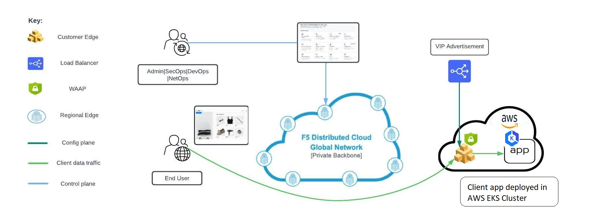
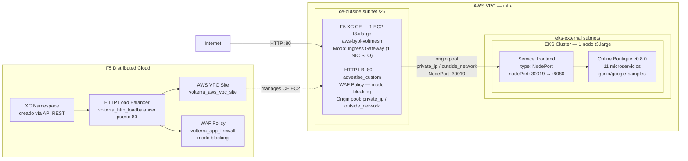

# WAF on CE AWS — Apply

Este workflow despliega una solución de **Web Application Firewall (WAF) con F5 Distributed Cloud sobre un Customer Edge (CE) en AWS**. El tráfico de internet es inspeccionado por F5 XC antes de llegar a la aplicación Online Boutique corriendo en un clúster EKS privado.

---




## Resumen de arquitectura y caso de uso

### ¿Para qué sirve este laboratorio?

| Capacidad                      | Descripción                                                                                                               |
| ------------------------------ | ------------------------------------------------------------------------------------------------------------------------- |
| WAF en CE                      | F5 XC actúa como WAF sobre **1 Customer Edge** en AWS en modo Ingress Gateway, sin pasar por Regional Edge (RE).         |
| Protección de aplicaciones EKS | La aplicación Online Boutique corre en EKS con el servicio `frontend` expuesto como **NodePort :30019** (sin IP pública directa). |
| Tráfico HTTP-only              | El HTTP LB de F5 XC escucha en **puerto 80** solamente; no requiere certificado TLS ni delegación de dominio.             |
| Ingress tipo `advertise_custom` | El LB se anuncia **solo en el CE Site** (`advertise_sites = true`), no en el Regional Edge global de F5 XC.              |
| WAF en modo blocking           | A diferencia del caso Azure, el WAF opera en **modo bloqueo** (`xc_waf_blocking = true`): los ataques reciben HTTP 403.  |
| Infraestructura efímera        | Todo se provisiona desde cero con Terraform y se destruye con el workflow de destroy.                                     |
| Estado remoto compartido       | Los cuatro workspaces de TFC comparten estado remoto para pasar outputs entre módulos.                                    |

### Arquitectura conceptual

```
Internet
   │
   │  HTTP :80
   ▼
┌────────────────────────────────────────────────────────────────────┐
│  AWS VPC  (infra — 1 VPC, subnets por AZ)                          │
│                                                                    │
│  ┌──────────────────────────────────────────────────────────────┐  │
│  │  F5 XC Customer Edge — 1 EC2 (t3.xlarge)                    │  │
│  │  Certified HW: aws-byol-voltmesh                             │  │
│  │  Modo: Ingress Gateway (1 NIC — ce-outside SLO subnet)       │  │
│  │                                                              │  │
│  │  • WAF policy (modo blocking)                                │  │
│  │  • HTTP Load Balancer — advertise_custom en CE Site          │  │
│  │  • Origin pool: private_ip / outside_network → NodePort :30019│ │
│  └──────────────────────┬───────────────────────────────────────┘  │
│                         │  mismo VPC (subnets internas)            │
│                         ▼                                          │
│  ┌──────────────────────────────────────────────────────────────┐  │
│  │  EKS Cluster — 1 nodo (t3.large)                             │  │
│  │  Endpoint: público+privado | skip_private_subnet_creation    │  │
│  │                                                              │  │
│  │  Service: frontend (type: NodePort)                          │  │
│  │  nodePort: 30019 → containerPort: 8080                       │  │
│  │       │                                                      │  │
│  │       ▼                                                      │  │
│  │  Online Boutique v0.8.0 (Google microservices-demo)          │  │
│  │  11 microservicios — imágenes gcr.io/google-samples          │  │
│  └──────────────────────────────────────────────────────────────┘  │
└────────────────────────────────────────────────────────────────────┘
```

### Detalles de infraestructura

#### Customer Edge (CE)

| Parámetro            | Valor                                                                                      |
| -------------------- | ------------------------------------------------------------------------------------------ |
| Cantidad de CEs      | **1**                                                                                      |
| Tipo de instancia    | `t3.xlarge`                                                                                |
| Hardware certificado | `aws-byol-voltmesh`                                                                        |
| Modo CE              | **Ingress Gateway** (1 NIC — SLO subnet `ce-outside`; sin NIC inside/egress separada)     |
| Subnet CE            | `ce-outside` subnet (`/26`) dentro del VPC de infra                                       |
| Tiempo de validación | 70 s (`null_resource.validation-wait-aws-ce`) + apply TF Params                           |
| SSH Key              | Clave pública derivada en runtime de `SSH_PRIVATE_KEY` con `ssh-keygen -y`                |

#### HTTP Load Balancer (F5 XC)

| Parámetro              | Valor                                              |
| ---------------------- | -------------------------------------------------- |
| Tipo                   | HTTP (no HTTPS, no auto-cert)                      |
| Puerto                 | 80                                                 |
| Método de advertise    | `advertise_custom` → solo en el CE Site            |
| Network de advertise   | `SITE_NETWORK_INSIDE_AND_OUTSIDE`                  |
| WAF mode               | **Blocking** (`xc_waf_blocking = true`)            |
| Selección de endpoints | `LOCAL_PREFERRED`                                  |
| Algoritmo de LB        | `LB_OVERRIDE`                                      |

#### Origin Pool

| Parámetro        | Valor                                                                                      |
| ---------------- | ------------------------------------------------------------------------------------------ |
| Tipo de servidor | `private_ip` con `outside_network = true` (`ip_address_on_site_pool = true`)              |
| IP destino       | IP privada del nodo EKS dentro del VPC, accedida vía NodePort                             |
| Puerto destino   | `30019` (NodePort del servicio `frontend`)                                                 |
| TLS al origen    | No (`no_tls = true`)                                                                       |

#### EKS Cluster

| Parámetro             | Valor                                                                  |
| --------------------- | ---------------------------------------------------------------------- |
| Nodos                 | 1 (desired=1, min=1, max=1)                                            |
| Tipo de instancia     | `t3.large`                                                             |
| Disco                 | 30 GB                                                                  |
| Versión EKS           | definida por `var.eks_version`                                         |
| Endpoint access       | Público + Privado (`endpoint_public_access = true`)                    |
| Subnets de nodos      | `eks-external` subnets (ya que `skip_private_subnet_creation = true`)  |
| Addons                | `aws-ebs-csi-driver` con IAM role dedicado                             |

#### Networking (VPC)

| Recurso             | Detalle                                                                   |
| ------------------- | ------------------------------------------------------------------------- |
| VPC                 | 1 VPC (`VPC_CIDR`), DNS support y hostnames habilitados                   |
| Internet Gateway    | 1 IGW adjunto al VPC                                                      |
| Subnets por AZ      | `management` (`/28`), `internal` (`/26`), `external` (`/26`), `app-cidr` (`/22`), `ce-outside` (`/26`) |
| Subnets EKS         | Subnets `external` (externas) — las internas se omiten por `skip_private_subnet_creation` |
| Subnet CE           | `ce-outside` (`/26`) — XC gestiona el routing de esta subnet (sin route table propia)   |
| Security Groups     | SGs dedicados para el EKS cluster y los worker nodes                      |

### Casos de Uso para Laboratorio

1. Demostración de WAF on CE en AWS sin necesidad de dominio público ni certificado TLS.
2. Laboratorio de protección de aplicaciones containerizadas en EKS con F5 XC en modo bloqueo.
3. Validación de políticas WAF de F5 XC (modo blocking) que bloquea XSS, SQLi y amenazas OWASP.
4. Entorno de pruebas efímero para workshops y capacitaciones de F5 Distributed Cloud en AWS.

### Casos de Uso Reales

1. **Protección de aplicaciones de e-commerce en AWS sin ALB público.** Retailers con plataformas en EKS (Magento, Shopify headless, etc.) que no quieren exponer un ALB/NLB público ni pagar por AWS WAF. El CE actúa como único punto de ingress con WAF de nivel enterprise, accediendo directamente al NodePort del nodo mediante IP privada dentro del VPC.

2. **Migración progresiva de WAF on-prem a nube.** Organizaciones que operan appliances físicos (BIG-IP iSeries, Fortinet) y quieren trasladar la inspección de tráfico a AWS sin rediseñar la arquitectura interna del EKS. El CE reemplaza el appliance con el mismo comportamiento de blocking y la misma política WAF.

3. **Seguridad de servicios internos accedidos solo desde la red corporativa.** Aplicaciones REST/gRPC en EKS que no deben ser públicas pero requieren WAF. Con `advertise_custom` aplicado únicamente al CE Site (no al Regional Edge global de F5 XC), el HTTP Load Balancer no es alcanzable desde el internet público — solo desde dentro del VPC o vía VPN conectada al CE.

4. **Cumplimiento PCI-DSS para aplicaciones de pago en contenedores.** La presencia de un WAF en modo blocking frente al frontend de una aplicación de checkout cubre el requisito PCI-DSS 6.4 (protección de aplicaciones web que procesan datos de tarjeta). El módulo aplica la política de bloqueo (`xc_waf_blocking = true`) sin requerir configuración manual en la consola de F5 XC.

5. **Disaster Recovery y failover multi-región.** Desplegar CE sites equivalentes en dos regiones AWS (ej. `us-east-1` y `us-west-2`) con el mismo HTTP Load Balancer de F5 XC. Si un CE queda inaccesible, F5 XC redirige el tráfico al site alternativo sin cambio de DNS ni intervención manual.

6. **Pipeline de DevSecOps con WAF real desde staging.** Equipos que necesitan que el entorno de staging tenga el mismo WAF policy que producción. Al ser completamente efímero (apply + destroy vía workflow), se puede levantar y destruir un entorno completo con WAF blocking para cada release candidate o rama de feature.

7. **Protección de microservicios legacy sin soporte TLS al origen.** Aplicaciones internas (legacy, backends IoT, servicios de integración) que solo soportan HTTP y donde añadir TLS al origen no es viable. La combinación `no_tls = true` + `http_only = true` del módulo cubre exactamente este patrón sin modificar la aplicación.

### Componentes desplegados

```
waf-ce-k8s-aws/infra  ──►  1 VPC + subnets (mgmt/int/ext/app-cidr/ce-outside) + IGW + SGs
        │
        │  (Remote State: VPC ID, subnet IDs, build suffix)
        ▼
waf-ce-k8s-aws/eks-cluster  ──►  1 EKS Cluster (1 nodo t3.large, endpoint público+privado)
        │                         IAM roles para cluster y worker nodes + addons EBS CSI
        │
        │  (Remote State: cluster name, endpoint, kubeconfig)
        ▼
waf-ce-k8s-aws/boutique  ──►  Online Boutique v0.8.0 (11 microservicios — kubectl_manifest)
        │                      Service frontend: NodePort :30019 → containerPort :8080
        │
        │  (Remote State: NodePort IP del nodo EKS)
        ▼
waf-ce-k8s-aws/xc/  ──►  XC Namespace (creado vía API REST curl)
                           volterra_cloud_credentials (AWS Access/Secret Key)
                           1 AWS VPC Site (1 EC2 t3.xlarge, aws-byol-voltmesh, ingress_gw)
                           1 Origin Pool (private_ip, outside_network, NodePort :30019)
                           1 HTTP Load Balancer (puerto 80, advertise en CE Site)
                           1 WAF Policy (volterra_app_firewall, modo blocking)
```

### Comunicación interna de Online Boutique

Solo el servicio `frontend` es accesible desde el exterior (vía el CE como NodePort). Los demás 10 microservicios se comunican entre sí exclusivamente mediante **gRPC** dentro del cluster y tienen `type: ClusterIP`.

| Servicio                | Protocolo  | Tipo Service | Accesible externamente                                |
| ----------------------- | ---------- | ------------ | ----------------------------------------------------- |
| `frontend`              | HTTP :8080 | `NodePort`   | **Sí** — vía CE (NodePort :30019 → HTTP LB puerto 80) |
| `checkoutservice`       | gRPC :5050 | `ClusterIP`  | No |
| `recommendationservice` | gRPC       | `ClusterIP`  | No |
| `productcatalogservice` | gRPC       | `ClusterIP`  | No |
| `cartservice`           | gRPC       | `ClusterIP`  | No |
| `paymentservice`        | gRPC       | `ClusterIP`  | No |
| `emailservice`          | gRPC :8080 | `ClusterIP`  | No |
| `shippingservice`       | gRPC       | `ClusterIP`  | No |
| `currencyservice`       | gRPC       | `ClusterIP`  | No |
| `adservice`             | gRPC       | `ClusterIP`  | No |
| `redis-cart`            | TCP :6379  | `ClusterIP`  | No |

El workflow configura `http_only = true` y no activa las funciones de API Protection (`xc_api_disc`, `xc_api_pro`) — la app no expone endpoints REST públicos. El WAF opera únicamente sobre el tráfico HTTP de la UI del `frontend`.

---

## Objetivo del workflow

1. Crear (o verificar) los cuatro workspaces de Terraform Cloud con modo de ejecución `local` y Remote State Sharing habilitado entre ellos.
2. Aprovisionar la infraestructura de red en AWS: VPC, subnets, IGW y Security Groups.
3. Desplegar el clúster EKS privado y la aplicación **Online Boutique** (manifests Kubernetes) como jobs separados.
4. Configurar en F5 Distributed Cloud el CE Site de AWS, el HTTP Load Balancer con WAF policy en modo blocking, y el namespace de la aplicación.

---

## Triggers

```yaml
on:
  workflow_dispatch:
```

Se ejecuta manualmente desde la pestaña **Actions** de GitHub. No tiene inputs opcionales; toda la configuración proviene de secretos y variables del repositorio.

---

## Secretos requeridos

Configurar en **Settings → Secrets and variables → Secrets**:

### Terraform Cloud

| Secreto                 | Descripción                                  |
| ----------------------- | -------------------------------------------- |
| `TF_API_TOKEN`          | Token de API de Terraform Cloud              |
| `TF_CLOUD_ORGANIZATION` | Nombre de la organización en Terraform Cloud |

### AWS

| Secreto          | Descripción                |
| ---------------- | -------------------------- |
| `AWS_ACCESS_KEY` | AWS Access Key ID          |
| `AWS_SECRET_KEY` | AWS Secret Access Key      |

### F5 Distributed Cloud

| Secreto           | Descripción                                                              |
| ----------------- | ------------------------------------------------------------------------ |
| `XC_TENANT`       | Nombre del tenant de F5 XC (sin `.console.ves.volterra.io`)              |
| `XC_API_URL`      | URL de la API de F5 XC (`https://<tenant>.console.ves.volterra.io/api`)  |
| `XC_P12_PASSWORD` | Contraseña del certificado `.p12` de F5 XC                               |
| `XC_API_P12_FILE` | Certificado API de F5 XC en formato `.p12` codificado en **base64**      |

### SSH

| Secreto           | Descripción                                                                                  |
| ----------------- | -------------------------------------------------------------------------------------------- |
| `SSH_PRIVATE_KEY` | Llave privada SSH (la pública se deriva en runtime con `ssh-keygen -y`). Usada en el CE EC2. |

---

## Variables requeridas

Configurar en **Settings → Secrets and variables → Variables**:

### Terraform Cloud — Workspaces

| Variable                      | Ejemplo               | Descripción                                     |
| ----------------------------- | --------------------- | ----------------------------------------------- |
| `TF_CLOUD_WORKSPACE_INFRA`    | `waf-ce-aws-infra`    | Nombre del workspace de TFC para AWS Infra      |
| `TF_CLOUD_WORKSPACE_EKS`      | `waf-ce-aws-eks`      | Nombre del workspace de TFC para EKS Cluster    |
| `TF_CLOUD_WORKSPACE_BOUTIQUE` | `waf-ce-aws-boutique` | Nombre del workspace de TFC para App Deploy     |
| `TF_CLOUD_WORKSPACE_XC`       | `waf-ce-aws-xc`       | Nombre del workspace de TFC para F5 XC          |

### Infraestructura AWS

| Variable         | Ejemplo                        | Descripción                                       |
| ---------------- | ------------------------------ | ------------------------------------------------- |
| `AWS_REGION`     | `us-east-1`                    | Región de AWS donde se despliegan los recursos    |
| `AZS`            | `us-east-1a,us-east-1b`        | Zonas de disponibilidad separadas por coma        |
| `VPC_CIDR`       | `10.0.0.0/16`                  | Bloque CIDR del VPC                               |
| `PROJECT_PREFIX` | `waf-ce`                       | Prefijo para nombrar todos los recursos creados   |

### Aplicación

| Variable          | Ejemplo                | Descripción                                   |
| ----------------- | ---------------------- | --------------------------------------------- |
| `XC_NAMESPACE`    | `boutique-prod`        | Namespace de F5 XC donde se crea el LB y WAF  |
| `BOUTIQUE_DOMAIN` | `boutique.example.com` | FQDN de la aplicación en el HTTP LB de F5 XC  |
| `XC_WAF_BLOCKING` | `false`                | Modo WAF: `true` = bloqueo, `false` = monitoreo (default recomendado) |

---

## Jobs principales

### `setup_tfc_workspaces`

Crea o actualiza los cuatro workspaces en Terraform Cloud vía la API REST:

- Execution Mode: **local** (el runner de GitHub ejecuta Terraform).
- Remote State Sharing: habilitado entre los cuatro workspaces, con todas las combinaciones posibles:
  - `infra` comparte estado con `eks`, `boutique` y `xc`.
  - `eks` comparte estado con `boutique` y `xc`.
  - `boutique` comparte estado con `xc`.

### `terraform_infra` — AWS Infra

- **Módulo:** `waf-ce-k8s-aws/infra`
- **Workspace TFC:** `TF_CLOUD_WORKSPACE_INFRA`
- **Qué crea:**
  - 1 VPC con DNS support y hostnames habilitados.
  - Internet Gateway adjunto al VPC.
  - Subnets por cada AZ: `management` (`/28`), `internal` (`/26`), `external` (`/26`), `app-cidr` (`/22`) y `ce-outside` (`/26`).
  - Security Groups dedicados para EKS cluster y worker nodes.
- **Step especial:** elimina del estado cualquier recurso Azure o GCP residual antes de `terraform validate` (compatibilidad multi-cloud del módulo).
- **Outputs que comparte:** VPC ID, IDs de subnets, build suffix — consumidos por los siguientes workspaces vía Remote State.

### `terraform_eks_creation` — AWS EKS

- **Módulo:** `waf-ce-k8s-aws/eks-cluster`
- **Workspace TFC:** `TF_CLOUD_WORKSPACE_EKS`
- **Qué crea:**
  - 1 clúster EKS con endpoint público + privado, acceso público sin restricción de CIDR.
  - Node group `private-node-group-1` con 1 nodo `t3.large` (desired=1, min=1, max=1, disco 30 GB), usando subnets **externas** (ya que `skip_private_subnet_creation = true`).
  - IAM roles para el cluster y los worker nodes con las políticas necesarias (`AmazonEKSWorkerNodePolicy`, `AmazonEKS_CNI_Policy`, `AmazonEC2ContainerRegistryReadOnly`).
  - Addons: `aws-ebs-csi-driver` con IAM role dedicado (IRSA).
- **Parámetros fijos en el job:**
  - `TF_VAR_desired_size`, `min_size`, `max_size` = `1`
  - `TF_VAR_skip_ha_az_node_group = "true"` — omite el segundo node group de HA.
  - `TF_VAR_skip_private_subnet_creation = "true"` — usa subnets externas para los nodos.

### `Boutique_app_deploy` — App Deploy

- **Módulo:** `waf-ce-k8s-aws/boutique`
- **Workspace TFC:** `TF_CLOUD_WORKSPACE_BOUTIQUE`
- **Qué crea:**
  - Deployment de **Online Boutique v0.8.0** (11 microservicios) vía `kubectl_manifest` con imágenes `gcr.io/google-samples/microservices-demo/*:v0.8.0`.
  - Service `frontend` de tipo **`NodePort`** con `nodePort: 30019` → `containerPort: 8080`. No usa LoadBalancer de AWS — el CE accede directamente al nodo por su IP privada y el NodePort.
  - Lee el kubeconfig del cluster EKS desde el Remote State del workspace `eks-cluster`.

### `volt_mesh_site_deploy` — F5 XC WAF

- **Módulo:** `waf-ce-k8s-aws/xc`
- **Workspace TFC:** `TF_CLOUD_WORKSPACE_XC`
- **Qué crea / configura:**
  - Namespace de F5 XC (creado vía API REST con curl + cert/key del P12, antes de Terraform; `200` y `409` son aceptados).
  - `volterra_cloud_credentials` con las credenciales de AWS (Access Key + Secret Key).
  - 1 AWS VPC Site (`volterra_aws_vpc_site`) en modo **Ingress Gateway** (`ingress_gw`): 1 EC2 `t3.xlarge`, hardware `aws-byol-voltmesh`, usando el VPC y la subnet `ce-outside` del workspace `infra`.
  - `null_resource.validation-wait-aws-ce` (sleep 70 s) + `volterra_tf_params_action` (`action = "apply"`, `wait_for_action = true`) para aprovisionar el CE en AWS vía la plataforma XC.
  - 1 Origin Pool (`volterra_origin_pool`) tipo `private_ip` + `outside_network = true` apuntando a la IP del nodo EKS con NodePort `30019`; sin TLS al origen, sin LoadBalancer de AWS.
  - 1 HTTP Load Balancer (`volterra_http_loadbalancer`) en puerto 80, `advertise_custom` → `SITE_NETWORK_INSIDE_AND_OUTSIDE` sobre el CE Site.
  - 1 WAF Policy (`volterra_app_firewall`) en **modo blocking** (`xc_waf_blocking = true`).
- **Parámetros fijos en el job:**

  | Variable Terraform               | Valor    | Propósito                                                           |
  | -------------------------------- | -------- | ------------------------------------------------------------------- |
  | `TF_VAR_aws_ce_site`             | `true`   | Crea el AWS VPC Site (`volterra_aws_vpc_site`)                      |
  | `TF_VAR_advertise_sites`         | `true`   | Usa `advertise_custom` (solo en CE Site, no en RE global)           |
  | `TF_VAR_ip_address_on_site_pool` | `true`   | Origin pool: `private_ip` con la IP del nodo EKS                   |
  | `TF_VAR_http_only`               | `true`   | HTTP port 80 (sin HTTPS, sin auto-cert, sin delegación DNS)         |
  | `TF_VAR_xc_waf_blocking`         | `XC_WAF_BLOCKING` (var) | Modo WAF: `true` = bloqueo (HTTP 403), `false` = monitoreo (solo log) |
  | `TF_VAR_serviceport`             | `30019`  | NodePort del servicio `frontend` de Online Boutique                 |

- **Pre-step especial:** la llave SSH pública se deriva de la privada en runtime con `ssh-keygen -y` e inyectada como `TF_VAR_ssh_key` vía `$GITHUB_ENV`. El cert/key del P12 se extrae con `openssl pkcs12 -legacy` (compatible con OpenSSL 3.x) y se eliminan inmediatamente después (`rm -f /tmp/client.crt /tmp/client.key`).

---

## Arquitectura desplegada por el workflow



---

## Troubleshooting rápido

- **Error `hostname not in correct format` en `setup_tfc_workspaces`:**
  Verificar que el secreto `TF_CLOUD_ORGANIZATION` esté correctamente configurado y no esté vacío.

- **Error `exit code 58` o falla en extracción de cert/key del P12:**
  Confirmar que `XC_API_P12_FILE` esté codificado en base64 correctamente:

  ```bash
  base64 -i api.p12 | pbcopy   # macOS
  base64 api.p12 | xclip       # Linux
  ```

  Si el P12 fue generado con OpenSSL 3.x, el flag `-legacy` ya está incluido en el workflow.

- **Error 404 al crear namespace XC:**
  El body del POST usa `"namespace":""` (vacío). Confirmar la URL base de la API: debe terminar en `/api`, y el step le quita ese sufijo antes de usarla.

- **Nodo EKS no aparece como `READY`:**
  Verificar que los IAM roles del node group tengan las políticas `AmazonEKSWorkerNodePolicy`, `AmazonEKS_CNI_Policy` y `AmazonEC2ContainerRegistryReadOnly` adjuntas. El addon `aws-ebs-csi-driver` también requiere su propio IAM role con IRSA.

- **El CE Site queda en `PROVISIONING` indefinidamente:**
  Verificar que las credenciales de AWS (`AWS_ACCESS_KEY` / `AWS_SECRET_KEY`) tengan permisos suficientes en IAM para crear EC2 instances, VPC resources y Security Groups. El proceso completo de aprovisionamiento del CE puede tardar entre 10 y 15 minutos.

- **Error 409 al destruir `volterra_cloud_credentials`:**
  F5 XC elimina el AWS VPC Site de forma asíncrona. El recurso `volterra_cloud_credentials` tiene un `destroy provisioner` con `sleep 90` para esperar. Si persiste, ejecutar el destroy nuevamente.

- **`terraform state list` muestra recursos Azure o GCP en el workspace `infra`:**
  El step `Remove stale non-AWS state` filtra y elimina automáticamente del estado cualquier recurso `azurerm_*` o `google_*` antes de aplicar. Esto ocurre en re-runs sobre workspaces previamente usados para otros clouds.

---

## Ejecución manual

**Archivo de workflow:** `.github/workflows/waf-on-ce-aws-apply.yml`

1. Ir a **Actions** en GitHub.
2. Seleccionar el workflow: **WAF on CE AWS - Deploy**.
3. Hacer clic en **Run workflow**.
4. Confirmar la ejecución. No hay inputs adicionales.

> **Tiempo estimado de ejecución: ~32 minutos** desde que se dispara el workflow hasta que todos los jobs finalizan en `success`. Una vez completado, espera **25 minutos adicionales** para que el CE Site quede en estado `ONLINE` en F5 XC y el HTTP Load Balancer comience a servir tráfico. El proceso más largo es el aprovisionamiento del Customer Edge en AWS (`volt_mesh_site_deploy`), que incluye la creación de la instancia EC2, el registro del CE en F5 XC y la validación de conectividad.

### Criterios de éxito

- Los cinco jobs terminan en estado `success` (`setup_tfc_workspaces`, `terraform_infra`, `terraform_eks_creation`, `Boutique_app_deploy`, `volt_mesh_site_deploy`).
- El namespace indicado en `XC_NAMESPACE` existe en la consola de F5 XC.
- El HTTP Load Balancer aparece publicado en el AWS CE Site.
- La aplicación Online Boutique es accesible desde internet a través del dominio configurado en `BOUTIQUE_DOMAIN`.

---

## Pruebas de seguridad — Rate Limiting y DDoS L7

Una vez desplegado el entorno, puedes validar las capacidades de protección del WAF usando el script incluido en el repositorio.

### Script: `herramientas/test_ddos.sh`

El script ejecuta tres pruebas contra el dominio configurado en `BOUTIQUE_DOMAIN`:

| Test | Qué simula | Detección esperada |
|---|---|---|
| **Rate Limit** | Burst de 300 requests con concurrencia 60 desde una sola IP | HTTP `429` o `403` al superar el umbral de rate limiting |
| **HTTP Flood L7** | 200 conexiones concurrentes durante 30 segundos (DDoS L7) | La app sigue respondiendo; el WAF absorbe el flood |
| **API Abuse** | 100 requests consecutivos a un endpoint con User-Agent sospechoso | HTTP `429` o `403` por política de abuso de API |

### Requisitos previos

```bash
# Instalar hey (generador de carga HTTP) — macOS
brew install hey
```

### Uso

```bash
chmod +x herramientas/test_ddos.sh
./herramientas/test_ddos.sh http://<BOUTIQUE_DOMAIN>
```

Ejemplo:

```bash
./herramientas/test_ddos.sh http://boutique.example.com
```

### Resultados reales de ejecución

#### Run 1 — WAF en modo monitoreo (`XC_WAF_BLOCKING=false`, sin Rate Limiting)

Todos los requests pasaron con `200`. El WAF registró el tráfico en Security Events pero no bloqueó nada. Resultados esperados en este modo:

| Test | Resultado | Detalle |
|---|---|---|
| Rate Limit | ⚠ WARN | 300/300 `200` — sin Rate Limit Policy configurada |
| HTTP Flood | ✓ PASS | 1852 `200` en 30 s — app operativa, latencia p99: 5.4 s |
| API Abuse | ⚠ WARN | 100/100 `200` — rate limiting no activo |

#### Run 2 — Rate Limiting activo en F5 XC (configurado en el HTTP LB)

Con Rate Limit Policy habilitada en el HTTP Load Balancer de F5 XC:

| Test | Resultado | Detalle |
|---|---|---|
| Rate Limit | ✓ PASS | **193/300 bloqueados con `429`** (64%) — umbral alcanzado tras ~107 req |
| HTTP Flood | ✓ PASS | **27,865/27,915 bloqueados con `429`** (>99.8%) — 924 req/s procesados, latencia p99: 0.6 s |
| API Abuse | ✓ PASS | **57/100 bloqueados con `429`** — patrón token bucket: `429`/`200` alternados |

```
==========================================
 Target: http://boutique.digitalvs.com
==========================================

=== TEST 1: Rate Limit — 300 requests, concurrencia 60 ===

  Requests/sec: 61.2756
  Status code distribution:
    [200] 107 responses
    [429] 193 responses

✓ PASS: El WAF bloqueó requests por rate limiting

=== TEST 2: HTTP Flood — concurrencia 200 durante 30 segundos ===

  Requests/sec: 924.1411
  Status code distribution:
    [200]  50 responses
    [429] 27865 responses

✓ PASS: La aplicación sobrevivió el flood — WAF operativo

=== TEST 3: API Abuse — 100 requests con User-Agent sospechoso ===

  Total bloqueados: 57/100
✓ PASS: WAF bloqueó 57 requests de abuso de API

==========================================
 Pruebas finalizadas
 Revisa los eventos en F5 XC Console:
 Security → App Firewall → Security Events
==========================================
```

### Notas importantes

> **Rate limiting no está habilitado por defecto** en F5 XC al desplegar con este workflow. La variable `TF_VAR_xc_waf_blocking = true` activa la política WAF (OWASP), pero el rate limiting requiere configurar una **Rate Limit Policy** en el HTTP Load Balancer desde la consola de F5 XC o via Terraform. Si el Test 1 devuelve `WARN`, agrega la política de rate limiting en el recurso `volterra_http_loadbalancer` del módulo `waf-ce-k8s-aws/xc`.

> **IP de origen**: al ejecutar desde tu máquina local, el WAF aplica las políticas sobre tu IP pública. Si te bloqueas, espera que expire el rate limit window (generalmente 1 minuto) o verifica el estado en **F5 XC Console → Security → App Firewall → Security Events**.

> **Diferencia con GitHub Actions**: en el workflow CI, los tests se ejecutan desde la IP del runner de GitHub. Localmente, el tráfico proviene de tu IP, lo que puede producir comportamientos distintos si el WAF tiene reglas basadas en reputación de IP.

---

## Cómo probar la aplicación

### 1. Verificar el CE Site en F5 XC

En la consola de F5 XC (`https://<tenant>.console.ves.volterra.io`):

1. Ir a **Infrastructure → Sites**.
2. Buscar el site con el nombre `<PROJECT_PREFIX>` — debe estar en estado **`ONLINE`**.
3. Ir a **Multi-Cloud App Connect → Manage → Load Balancers → HTTP Load Balancers** dentro del namespace `XC_NAMESPACE`.
4. Confirmar que el LB existe y que el origin pool muestra el servidor en estado **`HEALTHY`**.

> Si el CE Site aparece en `PROVISIONING` o `UPDATING`, esperar unos minutos. El aprovisionamiento del CE en AWS puede tardar entre 10 y 15 minutos.

### 2. Resolver el dominio (si no hay delegación DNS)

El HTTP LB de F5 XC está configurado con el dominio `BOUTIQUE_DOMAIN` pero **no usa delegación DNS** (`xc_delegation = false`). Para acceder desde el navegador o curl es necesario resolver el dominio manualmente.

**Obtener la IP pública del CE:**

En AWS → EC2 → Instances → buscar la instancia con nombre `<PROJECT_PREFIX>` → campo **Public IPv4 address**.

O desde la consola de F5 XC → **Infrastructure → Sites → `<site-name>` → Site Info** → campo **Public IP**.

**Agregar entrada en `/etc/hosts`:**

```bash
sudo nano /etc/hosts
```

Añadir al final:

```
<IP_PUBLICA_CE>   <BOUTIQUE_DOMAIN>
```

Por ejemplo:

```
54.123.45.67   boutique.example.com
```

### 3. Acceder a la aplicación

```bash
curl -v http://<BOUTIQUE_DOMAIN>/
```

La respuesta debe ser HTTP 200 con el HTML de Online Boutique. También se puede abrir en el navegador:

```
http://<BOUTIQUE_DOMAIN>/
```

### 4. Verificar la WAF (modo blocking)

A diferencia del caso Azure, el WAF está en **modo bloqueo**. Enviar un request con payload malicioso debe retornar **HTTP 403** con la página de bloqueo de F5 XC:

```bash
# XSS en query string — debe retornar 403
curl -v "http://<BOUTIQUE_DOMAIN>/?x=<script>alert(1)</script>"

# SQL injection básica — debe retornar 403
curl -v "http://<BOUTIQUE_DOMAIN>/?id=1'+OR+'1'='1"

# Path traversal — debe retornar 403
curl -v "http://<BOUTIQUE_DOMAIN>/../../etc/passwd"
```

**Verificar los eventos en F5 XC:**

1. Ir a **Multi-Cloud App Connect → Namespaces → `XC_NAMESPACE`**.
2. Ir a **Security → Security Events**.
3. Los requests anteriores deben aparecer con la firma WAF detectada (`ATTACK_TYPE_XSS`, `ATTACK_TYPE_SQL_INJECTION`, etc.) con acción **`BLOCK`**.

### 5. Validar que el tráfico no pasa por la nube de F5 XC

Con `advertise_sites = true` el HTTP LB **no tiene VIP en el Regional Edge (RE) global de F5 XC**. La IP pública a la que se conecta el cliente es directamente la del CE en AWS (rango Amazon), no una IP de Volterra/F5.

**Verificar el ASN de la IP del CE:**

```bash
curl -s https://ipinfo.io/<IP_CE>/json
```

La respuesta debe mostrar `"org": "AS16509 Amazon.com, Inc."`. Si el tráfico pasara por un RE de F5 XC, el ASN sería de Volterra (AS9009) o F5.

**Verificar en la consola de F5 XC:**

En **Multi-Cloud App Connect → Namespaces → `XC_NAMESPACE` → HTTP Load Balancers → `<nombre-lb>`**:

- El campo **"Advertise"** debe mostrar **`Custom`** apuntando al CE Site — **no** `Public VIP` ni `Internet (RE VIP)`.

---

## Destroy del laboratorio

El archivo `.github/workflows/waf-on-ce-aws-destroy.yml` destruye **todos** los recursos creados por el apply en orden inverso para evitar dependencias huérfanas en F5 XC y AWS.

**Trigger:** `workflow_dispatch` — ejecución manual desde GitHub Actions.

### Orden de destrucción

```
volt_mesh_site_deploy  (1° — elimina LB, WAF policy, CE Site, namespace XC)
      │
      ▼
Boutique_app_deploy    (2° — elimina manifests de Online Boutique en EKS)
      │
      ▼
terraform_eks_creation (3° — elimina EKS cluster, node groups, IAM roles)
      │
      ▼
terraform_infra        (4° — elimina VPC, subnets, IGW, Security Groups)
```

> El recurso `volterra_cloud_credentials` incluye un `destroy provisioner` con `sleep 90` para que F5 XC tenga tiempo de eliminar el AWS VPC Site antes de intentar borrar las credenciales (evita error 409).

---

## Pruebas de seguridad — Online Boutique con F5 XC WAF

Online Boutique es una app cloud-native de e-commerce con frontend HTTP y ~10 microservicios internos en gRPC. Las pruebas de WAF se aplican sobre la superficie HTTP pública del frontend.

### ¿Para qué sirve Online Boutique con F5 XC y qué NO sirve?

| Tipo de prueba                          | Online Boutique | Notas                                                                                                       |
| --------------------------------------- | :-------------: | ----------------------------------------------------------------------------------------------------------- |
| WAF general (frontend HTTP)             | ✅ Válido        | Protección de la superficie HTTP del frontend: rutas de catálogo, carrito, checkout                         |
| DDoS L7 / rate limiting                 | ✅ Ideal         | Tráfico realista de e-commerce — flood sobre `/` o rutas de producto                                        |
| XSS en parámetros HTTP                  | ✅ Válido        | La app no filtra inputs — WAF puede demostrar bloqueo                                                       |
| SQLi / Command Injection                | ⚠️ Limitado     | La app no tiene formularios vulnerables por diseño — WAF bloquea pero la app tampoco sería vulnerable        |
| API Discovery / API Protection          | ❌ Pobre         | Los microservicios se comunican internamente por gRPC, no como APIs REST públicas. Para API Security usar **crAPI** (caso 5) o **Arcadia Finance** (caso 1) |
| OWASP Top 10 dirigidos (módulos)        | ❌ No aplica     | La app no tiene módulos de vulnerabilidades didácticas — para eso es **DVWA** (caso 4)                      |

### Pruebas de WAF OWASP con curl (`XC_WAF_BLOCKING=true`)

Con el WAF en modo bloqueo, los siguientes payloads deben retornar **HTTP 403**:

```bash
# XSS en parámetro de búsqueda de productos
curl -i "http://boutique.digitalvs.com/?q=<script>alert(document.cookie)</script>"
# Esperado con blocking: 403 + Request Rejected

# SQLi en ruta de producto
curl -i "http://boutique.digitalvs.com/?id=1'+OR+'1'='1"
# Esperado con blocking: 403 + Request Rejected

# Path traversal
curl -i "http://<BOUTIQUE_DOMAIN>/../../../../etc/passwd"
# Esperado con blocking: 403 + Request Rejected

# Scanner User-Agent (requiere Bot Defense o signature de scanner)
curl -i "http://<BOUTIQUE_DOMAIN>/" \
  -H "User-Agent: sqlmap/1.7.8#stable (https://sqlmap.org)"
```

> Con `XC_WAF_BLOCKING=false` (modo monitoreo), estos requests reciben `200` y la app los procesa — el WAF solo los registra en Security Events sin bloquear.

### Simulación de DDoS L7 (flood básico)

```bash
# Generar 200 requests seguidos contra el frontend
for i in $(seq 1 200); do
  curl -s -o /dev/null -w "%{http_code}\n" "http://<BOUTIQUE_DOMAIN>/"
done | sort | uniq -c
# Con rate limiting activo en XC: respuestas 429 deberían aparecer tras el umbral
```

Los eventos de bloqueo quedan registrados en F5 XC → **Security → Security Events** del namespace correspondiente.
