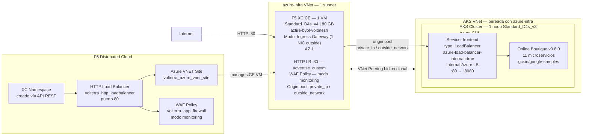

# WAF on CE Azure — Apply

Este workflow despliega una solución de **Web Application Firewall (WAF) con F5 Distributed Cloud sobre un Customer Edge (CE) en Azure**. El tráfico de internet es inspeccionado por F5 XC antes de llegar a la aplicación Online Boutique corriendo en un clúster AKS privado.

---

## Resumen de arquitectura y caso de uso

### ¿Para qué sirve este laboratorio?

| Capacidad                      | Descripción                                                                                                             |
| ------------------------------ | ----------------------------------------------------------------------------------------------------------------------- |
| WAF en CE                      | F5 XC actúa como WAF sobre **1 Customer Edge** en Azure en modo Ingress Gateway, sin pasar por Regional Edge (RE).     |
| Protección de aplicaciones AKS | La aplicación Online Boutique corre en AKS con un **Azure Internal Load Balancer** (sin IP pública directa).           |
| Tráfico HTTP-only              | El HTTP LB de F5 XC escucha en **puerto 80** solamente; no requiere certificado TLS ni delegación de dominio.           |
| Ingress tipo `advertise_custom` | El LB se anuncia **solo en el CE Site** (`advertise_sites = true`), no en el Regional Edge global de F5 XC.            |
| Infraestructura efímera        | Todo se provisiona desde cero con Terraform y se destruye con el workflow de destroy.                                   |
| Estado remoto compartido       | Los tres workspaces de TFC comparten estado remoto para pasar outputs entre módulos.                                    |

### Arquitectura conceptual

```
Internet
   │
   │  HTTP :80
   ▼
┌────────────────────────────────────────────────────────────────┐
│  Azure VNet  (azure-infra — 1 VNet, 1 subnet)                   │
│                                                                  │
│  ┌──────────────────────────────────────────────────────────┐   │
│  │  F5 XC Customer Edge — 1 VM (Standard_D4s_v4, 80 GB)    │   │
│  │  Certified HW: azure-byol-voltmesh                       │   │
│  │  Modo: Ingress Gateway (1 NIC — outside)                 │   │
│  │  AZ: 1 | Subnet: ce_waap_az_subnet                       │   │
│  │                                                           │   │
│  │  • WAF policy (modo monitoring por defecto)              │   │
│  │  • HTTP Load Balancer — advertise_custom en CE Site      │   │
│  │  • Origin pool: private_ip / outside_network             │   │
│  └──────────────────────┬────────────────────────────────────┘  │
│                         │  VNet Peering (bidireccional)         │
│                         ▼                                        │
│  ┌──────────────────────────────────────────────────────────┐   │
│  │  AKS VNet  (creada por AKS, pereada con azure-infra)     │   │
│  │                                                           │   │
│  │  AKS Cluster — 1 nodo (Standard_D4s_v3)                  │   │
│  │  Network plugin: Azure CNI | Auto-scaling: deshabilitado  │   │
│  │                                                           │   │
│  │  Service: frontend (type: LoadBalancer)                   │   │
│  │  Annotation: azure-load-balancer-internal = "true"        │   │
│  │  → Azure Internal LB (IP privada, puerto 80→8080)        │   │
│  │       │                                                   │   │
│  │       ▼                                                   │   │
│  │  Online Boutique v0.8.0 (Google microservices-demo)       │   │
│  │  11 microservicios — imágenes gcr.io/google-samples       │   │
│  └──────────────────────────────────────────────────────────┘   │
└────────────────────────────────────────────────────────────────┘
```

### Detalles de infraestructura

#### Customer Edge (CE)

| Parámetro            | Valor                    |
| -------------------- | ------------------------ |
| Cantidad de CEs      | **1**                    |
| Tipo de VM (Azure)   | `Standard_D4s_v4`        |
| Hardware certificado | `azure-byol-voltmesh`    |
| Modo CE              | **Ingress Gateway** (1 NIC — outside únicamente; no tiene NIC de inside/egress separada) |
| Availability Zone    | AZ 1                     |
| Disco del OS         | 80 GB                    |
| Subnet               | `ce_waap_az_subnet` (de azure-infra VNet) |
| Tiempo de validación | 70 s (`null_resource.validation-wait`) + apply TF Params |

#### HTTP Load Balancer (F5 XC)

| Parámetro              | Valor                                           |
| ---------------------- | ----------------------------------------------- |
| Tipo                   | HTTP (no HTTPS, no auto-cert)                   |
| Puerto                 | 80                                              |
| Método de advertise    | `advertise_custom` → solo en el CE Site         |
| Network de advertise   | `SITE_NETWORK_INSIDE_AND_OUTSIDE`               |
| WAF mode               | Monitoring (default; `xc_waf_blocking = false`) |
| Selección de endpoints | `LOCAL_PREFERRED`                               |
| Algoritmo de LB        | `LB_OVERRIDE`                                   |

#### Origin Pool

| Parámetro        | Valor                                                        |
| ---------------- | ------------------------------------------------------------ |
| Tipo de servidor | `private_ip` con `outside_network = true`                   |
| IP destino       | IP interna del Azure Internal LB del AKS (`ip_address_on_site_pool = true`) |
| Puerto destino   | 80                                                           |
| TLS al origen    | No (`no_tls = true`)                                         |

#### AKS Cluster

| Parámetro         | Valor               |
| ----------------- | ------------------- |
| Nodos             | 1                   |
| VM size           | `Standard_D4s_v3`   |
| Network plugin    | Azure CNI           |
| Auto-scaling      | Deshabilitado       |
| Identidad         | SystemAssigned      |
| Ingress de la app | Service `LoadBalancer` con `azure-load-balancer-internal: "true"` → Azure Internal LB (solo IP privada) |
| VNet              | Separada de azure-infra; conectada por VNet Peering bidireccional |

#### Networking

| Recurso                  | Detalle                                                                      |
| ------------------------ | ---------------------------------------------------------------------------- |
| VNet azure-infra         | 1 VNet con 1 subnet (`ce_waap_az_subnet`) para el CE                         |
| VNet AKS                 | Creada automáticamente por AKS (`use_new_vnet = true`)                       |
| VNet Peering             | Bidireccional (`peer_a2b` + `peer_b2a`) con `allow_forwarded_traffic = true` |
| Tiempo de espera para LB | 90 s (`time_sleep.wait_30_seconds`) para que el Internal LB adquiera IP      |

### Casos de uso típicos

1. Demostración de WAF on CE sin necesidad de dominio público ni certificado TLS.
2. Laboratorio de protección de aplicaciones containerizadas en AKS con F5 XC.
3. Validación de políticas WAF de F5 XC (modo monitoring) sobre tráfico a microservicios.
4. Entorno de pruebas efímero para workshops y capacitaciones de F5 Distributed Cloud.

### Componentes desplegados

```
azure/azure-infra  ──►  1 VNet + 1 Subnet (ce_waap_az_subnet) + Resource Group
        │
        │  (Remote State: VNet ID, Subnet ID, Resource Group)
        ▼
azure/aks-cluster  ──►  1 AKS Cluster (1 nodo Standard_D4s_v3, Azure CNI)
        │                Online Boutique v0.8.0 (manifest.yaml — kubectl apply)
        │                Service frontend: Internal Azure LB (:80→:8080)
        │                VNet Peering bidireccional con azure-infra VNet
        │
        │  (Remote State: IP del Internal LB)
        ▼
xc/                ──►  XC Namespace (creado vía API curl)
                         1 Azure CE Site (1 VM ingress_gw, azure-byol-voltmesh)
                         1 Origin Pool (private_ip, outside_network, no TLS)
                         1 HTTP Load Balancer (puerto 80, advertise en CE Site)
                         1 WAF Policy (volterra_app_firewall, modo monitoring)
```

---

## Objetivo del workflow

1. Crear (o verificar) los tres workspaces de Terraform Cloud con modo de ejecución `local` y Remote State Sharing habilitado entre ellos.
2. Aprovisionar la infraestructura de red en Azure: VNet, subredes y los recursos de soporte (security groups, etc.).
3. Desplegar el clúster AKS privado con la aplicación **Online Boutique** (Helm/manifest) y el CE WAF VM.
4. Configurar en F5 Distributed Cloud el CE Site de Azure, el HTTP Load Balancer con WAF policy, y el namespace de la aplicación.

---

## Triggers

```yaml
on:
  workflow_dispatch:
```

Se ejecuta manualmente desde la pestaña **Actions** de GitHub. No tiene inputs opcionales; toda la configuración proviene de secretos y variables del repositorio.

---

## Secretos requeridos

Configurar en **Settings → Secrets and variables → Secrets**:

### Terraform Cloud

| Secreto                 | Descripción                                  |
| ----------------------- | -------------------------------------------- |
| `TF_API_TOKEN`          | Token de API de Terraform Cloud              |
| `TF_CLOUD_ORGANIZATION` | Nombre de la organización en Terraform Cloud |

### Azure

| Secreto                 | Descripción                             |
| ----------------------- | --------------------------------------- |
| `AZURE_SUBSCRIPTION_ID` | ID de la suscripción de Azure           |
| `AZURE_TENANT_ID`       | ID del tenant de Azure Active Directory |
| `AZURE_CLIENT_ID`       | App ID del Service Principal de Azure   |
| `AZURE_CLIENT_SECRET`   | Password del Service Principal de Azure |

### F5 Distributed Cloud

| Secreto           | Descripción                                                             |
| ----------------- | ----------------------------------------------------------------------- |
| `XC_TENANT`       | Nombre del tenant de F5 XC (sin `.console.ves.volterra.io`)             |
| `XC_API_URL`      | URL de la API de F5 XC (`https://<tenant>.console.ves.volterra.io/api`) |
| `XC_P12_PASSWORD` | Contraseña del certificado `.p12` de F5 XC                              |
| `XC_API_P12_FILE` | Certificado API de F5 XC en formato `.p12` codificado en **base64**     |

### SSH

| Secreto           | Descripción                                                                                 |
| ----------------- | ------------------------------------------------------------------------------------------- |
| `SSH_PRIVATE_KEY` | Llave privada SSH (la pública se deriva en runtime con `ssh-keygen -y`). Usada en el CE VM. |

---

## Variables requeridas

Configurar en **Settings → Secrets and variables → Variables**:

### Terraform Cloud — Workspaces

| Variable                         | Ejemplo           | Descripción                                  |
| -------------------------------- | ----------------- | -------------------------------------------- |
| `TF_CLOUD_WORKSPACE_AZURE_INFRA` | `waf-ce-az-infra` | Nombre del workspace de TFC para Azure Infra |
| `TF_CLOUD_WORKSPACE_AKS_CLUSTER` | `waf-ce-az-aks`   | Nombre del workspace de TFC para AKS Cluster |
| `TF_CLOUD_WORKSPACE_XC_DEPLOY`   | `waf-ce-az-xc`    | Nombre del workspace de TFC para F5 XC       |

### Infraestructura

| Variable         | Ejemplo  | Descripción                                      |
| ---------------- | -------- | ------------------------------------------------ |
| `AZURE_REGION`   | `eastus` | Región de Azure donde se despliegan los recursos |
| `PROJECT_PREFIX` | `waf-ce` | Prefijo para nombrar todos los recursos creados  |

### Aplicación

| Variable       | Ejemplo                | Descripción                                  |
| -------------- | ---------------------- | -------------------------------------------- |
| `XC_NAMESPACE` | `boutique-prod`        | Namespace de F5 XC donde se crea el LB y WAF |
| `APP_DOMAIN`   | `boutique.example.com` | FQDN de la aplicación en el HTTP LB de F5 XC |

---

## Jobs principales

### `setup_tfc_workspaces`

Crea o actualiza los tres workspaces en Terraform Cloud vía la API REST:

- Execution Mode: **local** (el runner de GitHub ejecuta Terraform).
- Remote State Sharing: habilitado entre los tres workspaces.
  - `azure-infra` comparte estado con `aks-cluster` y `xc-deploy`.
  - `aks-cluster` comparte estado con `xc-deploy`.

### `terraform_infra` — Azure Infra

- **Módulo:** `azure/azure-infra`
- **Workspace TFC:** `TF_CLOUD_WORKSPACE_AZURE_INFRA`
- **Qué crea:**
  - 1 Resource Group y 1 Virtual Network de Azure.
  - 1 subnet (`ce_waap_az_subnet`) donde se conectará la NIC del CE.
  - **No crea** NSGs ni Security Groups adicionales en este módulo (solo la VNet y subnet básica).
- **Configuración especial:** escribe `github.auto.tfvars` con `aks-cluster = true` (y el resto en `false`) para habilitar únicamente los recursos de red de VNet+subnet necesarios para este laboratorio, excluyendo NGINX, BIG-IP, etc.
- **Outputs que comparte:** ID de VNet, nombre de VNet, nombre de Resource Group, nombre de subnet — consumidos por `xc/` vía Remote State.

### `terraform_aks` — Azure AKS

- **Módulo:** `azure/aks-cluster`
- **Workspace TFC:** `TF_CLOUD_WORKSPACE_AKS_CLUSTER`
- **Qué crea:**
  - 1 clúster AKS con 1 nodo (`Standard_D4s_v3`), identidad `SystemAssigned`, network plugin `azure` (Azure CNI), auto-scaling deshabilitado.
  - Deployment de **Online Boutique v0.8.0** (11 microservicios) vía `kubectl apply -f manifest.yaml` (kubectl se descarga en runtime).
  - Service `frontend` tipo `LoadBalancer` con la annotation `azure-load-balancer-internal: "true"` → Azure Internal LB con IP privada, puerto 80 → 8080.
  - VNet Peering bidireccional (`peer_a2b` + `peer_b2a`) entre la VNet de AKS y la VNet de azure-infra para que el CE pueda alcanzar el Internal LB.
  - `time_sleep` de 90 segundos para que el Internal LB tenga IP asignada antes de que XC intente conectarse.
- **Nota:** usa `TF_VAR_use_new_vnet = "true"` para que el nodo AKS cree su propia VNet y se peree, en lugar de reutilizar la subnet de azure-infra.

### `terraform_xc_lb` — F5XC WAF

- **Módulo:** `xc/`
- **Workspace TFC:** `TF_CLOUD_WORKSPACE_XC_DEPLOY`
- **Qué crea / configura:**
  - Namespace de F5 XC (creado vía API REST con curl + cert/key del P12, antes de Terraform; `200` y `409` son aceptados).
  - `volterra_cloud_credentials` con las credenciales del Service Principal de Azure.
  - 1 Azure VNET Site (`volterra_azure_vnet_site`) en modo **Ingress Gateway** (`ingress_gw`): 1 VM `Standard_D4s_v4`, hardware `azure-byol-voltmesh`, AZ 1, disco 80 GB, subnet `ce_waap_az_subnet` de la VNet existente de azure-infra.
  - `null_resource.validation-wait` (sleep 70 s) + `volterra_tf_params_action` (`action = "apply"`, `wait_for_action = true`) para aprovisionar el CE en Azure vía la plataforma XC.
  - 1 Origin Pool (`volterra_origin_pool`) tipo `private_ip` + `outside_network = true` apuntando a la IP del Internal LB del AKS; sin TLS al origen (`no_tls = true`), puerto 80.
  - 1 HTTP Load Balancer (`volterra_http_loadbalancer`) en puerto 80, advertise con `advertise_custom` → `SITE_NETWORK_INSIDE_AND_OUTSIDE` sobre el CE Site.
  - 1 WAF Policy (`volterra_app_firewall`) en **modo monitoring** (el workflow no setea `xc_waf_blocking`, por lo que usa el default `false`).
- **Parámetros fijos en el job:**

  | Variable Terraform               | Valor              | Propósito                                                    |
  | -------------------------------- | ------------------ | ------------------------------------------------------------ |
  | `TF_VAR_az_ce_site`              | `true`             | Crea el Azure CE Site (`volterra_azure_vnet_site`)           |
  | `TF_VAR_azure_xc_machine_type`   | `Standard_D4s_v4`  | Tamaño de VM del CE en Azure                                 |
  | `TF_VAR_advertise_sites`         | `true`             | Usa `advertise_custom` (solo en CE Site, no en RE global)    |
  | `TF_VAR_ip_address_on_site_pool` | `true`             | Origin pool: `private_ip` con la IP del Internal LB del AKS |
  | `TF_VAR_http_only`               | `true`             | HTTP port 80 (sin HTTPS, sin auto-cert, sin delegación DNS)  |

- **Pre-step especial:** la llave SSH pública se deriva de la privada en runtime con `ssh-keygen -y` e inyectada como `TF_VAR_ssh_key` vía `$GITHUB_ENV`. El cert/key del P12 se extrae con `openssl pkcs12 -legacy` (compatible con OpenSSL 3.x).

---

## Arquitectura desplegada por el workflow



---

## Resource Groups creados en Azure

El laboratorio genera exactamente **3 resource groups** en Azure:

### `<prefix>-rg-<suffix>` (ej. `accessq-rg-3dbd`)

Creado por Terraform en `azure/azure-infra`. Es el **RG principal compartido** del laboratorio. Contiene:

- La **VNet** (`<prefix>-vnet-<suffix>`) con la subnet donde se conecta la NIC del CE (`ce_waap_az_subnet`).
- El **AKS cluster** — el módulo `azure/aks-cluster` lee el nombre de este RG vía Remote State de `azure-infra` y despliega el cluster aquí, no en un RG propio.
- El **Azure Internal Load Balancer** del servicio `frontend` de Online Boutique — Azure lo crea aquí porque el Service de Kubernetes tiene la annotation `azure-load-balancer-internal: "true"` y el RG de referencia es este.
- El **VNet Peering** bidireccional entre este VNet y el VNet interno del AKS.

### `<prefix>-rg-xc-<suffix>` (ej. `accessq-rg-xc-3dbd`)

Creado automáticamente por **F5 XC Platform** cuando se ejecuta el `volterra_tf_params_action apply`. El nombre lo define el campo `resource_group` del recurso `volterra_azure_vnet_site` en `xc/azure_ce_site.tf`. Contiene exclusivamente los recursos del Customer Edge:

- La **VM** del CE (`Standard_D4s_v4`, 80 GB, hardware `azure-byol-voltmesh`).
- La **NIC** de la VM conectada a la subnet `ce_waap_az_subnet` del VNet del RG principal.
- Los recursos de red asociados al CE (IP pública de entrada, NSG del CE).

> Terraform no crea este RG directamente — le pasa el nombre a F5 XC y la plataforma lo provisiona en Azure usando las credenciales del Service Principal configurado en `volterra_cloud_credentials`.

### `MC_<prefix>-rg-<suffix>_<prefix>-aks-<suffix>_<region>` (ej. `MC_accessq-rg-3dbd_accessq-aks-3dbd_centralus`)

Creado **automáticamente por Azure** al aprovisionar el AKS cluster. Es el *Managed Resource Group* del plano de datos de AKS — Azure lo gestiona completamente y no puede eliminarse directamente. Contiene:

- Los **nodos (VMs)** del cluster (`Standard_D4s_v3`).
- La **VNet propia del AKS** — se crea porque `use_new_vnet = true`, lo que significa que el nodo AKS no usa la subnet de `accessq-rg-3dbd` sino su propia VNet privada.
- Las **NICs, discos y NSGs** de los nodos.

El módulo `azure/aks-cluster` referencia este RG directamente en el peering `peer_b2a` para configurar el VNet Peering desde el lado del AKS hacia el VNet de `azure-infra`, permitiendo que el CE alcance la IP privada del Internal LB.

---

## Troubleshooting rápido

- **Error `hostname not in correct format` en `setup_tfc_workspaces`:**
  Verificar que el secreto `TF_CLOUD_ORGANIZATION` esté correctamente configurado y no esté vacío.

- **Error `exit code 58` o falla en extracción de cert/key del P12:**
  Confirmar que `XC_API_P12_FILE` esté codificado en base64 correctamente:

  ```bash
  base64 -i api.p12 | pbcopy   # macOS
  base64 api.p12 | xclip       # Linux
  ```

  Si el P12 fue generado con OpenSSL 3.x, el flag `-legacy` ya está incluido en el workflow.

- **Error 404 al crear namespace XC:**
  El body del POST usa `"namespace":""` (vacío). Confirmar la URL base de la API: debe terminar en `/api`, y el step le quita ese sufijo antes de usarla.

- **`data.azurerm_lb.lb` falla durante `terraform plan` (AKS):**
  El data source del LB depende del clúster AKS. El workflow usa `replace_triggered_by` y `depends_on` para garantizar el orden. Si ocurre en un re-run manual, verificar que el workspace de `azure-infra` tenga estado válido.

- **Error 409 al destruir `volterra_cloud_credentials`:**
  F5 XC elimina el Azure VNET Site de forma asíncrona. El recurso `volterra_cloud_credentials` tiene un `destroy provisioner` con `sleep 90` para esperar. Si persiste, ejecutar el destroy nuevamente.

- **AKS LB tarda en adquirir IP:**
  El paso de `time_sleep` aguarda 90 segundos después del deploy del manifest. En regiones con carga alta puede necesitar más tiempo.

---

## Ejecución manual

1. Ir a **Actions** en GitHub.
2. Seleccionar el workflow: **F5XC WAF on CE Deploy**.
3. Hacer clic en **Run workflow**.
4. Confirmar la ejecución. No hay inputs adicionales.

### Criterios de éxito

- Los cuatro jobs terminan en estado `success`.
- El namespace indicado en `XC_NAMESPACE` existe en la consola de F5 XC.
- El HTTP Load Balancer aparece publicado en el Azure CE Site.
- La aplicación Online Boutique es accesible desde internet a través del dominio configurado en `APP_DOMAIN`.

---

## Cómo probar la aplicación

### 1. Verificar el CE Site en F5 XC

En la consola de F5 XC (`https://<tenant>.console.ves.volterra.io`):

1. Ir a **Infrastructure → Sites**.
2. Buscar el site con el nombre `<PROJECT_PREFIX>` — debe estar en estado **`ONLINE`**.
3. Ir a **Multi-Cloud App Connect → Manage → Load Balancers → HTTP Load Balancers** dentro del namespace `XC_NAMESPACE`.
4. Confirmar que el LB existe y que el origin pool muestra el servidor en estado **`HEALTHY`**.

> Si el CE Site aparece en `PROVISIONING` o `UPDATING`, esperar unos minutos. El aprovisionamiento del CE en Azure puede tardar entre 10 y 15 minutos.

### 2. Resolver el dominio (si no hay delegación DNS)

El HTTP LB de F5 XC está configurado con el dominio `APP_DOMAIN` pero **no usa delegación DNS** (`xc_delegation = false`). Para poder acceder desde el navegador o curl es necesario resolver el dominio manualmente.

**Obtener la IP pública del CE:**

En Azure → Resource Group `<prefix>-rg-xc-<suffix>` → buscar la IP pública asociada a la NIC del CE.

O desde la consola de F5 XC → **Infrastructure → Sites → <site-name> → Site Info** → campo **Public IP**.

**Agregar entrada en `/etc/hosts`:**

```bash
sudo nano /etc/hosts
```

Añadir al final:

```
<IP_PUBLICA_CE>   <APP_DOMAIN>
```

Por ejemplo:

```
20.10.5.123   boutique.example.com
```

### 3. Acceder a la aplicación

```bash
curl -v http://<APP_DOMAIN>/
```

La respuesta debe ser HTTP 200 con el HTML de Online Boutique (Google microservices-demo). También se puede abrir en el navegador:

```
http://<APP_DOMAIN>/
```

### 4. Verificar la WAF (modo monitoring)

Enviar un request con payload malicioso. En modo monitoring el request **pasa**, pero queda registrado como Security Event en F5 XC:

```bash
# XSS en query string
curl -v "http://<APP_DOMAIN>/?x=<script>alert(1)</script>"

# SQL injection básica
curl -v "http://<APP_DOMAIN>/?id=1'+OR+'1'='1"

# Path traversal
curl -v "http://<APP_DOMAIN>/../../etc/passwd"
```

**Verificar los eventos en F5 XC:**

1. Ir a **Multi-Cloud App Connect → Namespaces → `XC_NAMESPACE`**.
2. Ir a **Security → Security Events**.
3. Los requests anteriores deben aparecer con la firma WAF detectada (tipo `ATTACK_TYPE_XSS`, `ATTACK_TYPE_SQL_INJECTION`, etc.) aunque con acción `ALLOW` (monitoring mode).

### 5. Cambiar WAF a modo blocking (opcional)

Para bloquear ataques en lugar de solo registrarlos, añadir la variable de entorno en el job `terraform_xc_lb` del apply workflow:

```yaml
TF_VAR_xc_waf_blocking: "true"
```

Luego volver a ejecutar el workflow. Con blocking activado, los requests maliciosos recibirán un HTTP 403 con la página de bloqueo de F5 XC.

### 6. Validar que el tráfico no pasa por la nube de F5 XC

Con `advertise_sites = true` el HTTP LB **no tiene VIP en el Regional Edge (RE) global de F5 XC**. La IP pública a la que se conecta el cliente es directamente la del CE en Azure (rango Microsoft), no una IP de Volterra/F5.

#### 6.1 Verificar el ASN de la IP del CE

```bash
curl -s https://ipinfo.io/<IP_CE>/json
```

La respuesta debe mostrar `"org": "AS8075 Microsoft Corporation"`. Si el tráfico pasara por un RE de F5 XC, el ASN sería de Volterra (AS9009) o F5.

Ejemplo de salida esperada con la IP del CE (`4.150.186.64`):

```json
{
  "ip": "4.150.186.64",
  "city": "Des Moines",
  "region": "Iowa",
  "country": "US",
  "org": "AS8075 Microsoft Corporation",
  ...
}
```

#### 6.2 Traceroute — el camino va a Azure directamente

```bash
traceroute -n -m 20 <IP_CE>
```

A partir de los primeros hops del ISP, el tráfico entra al backbone de Microsoft (`104.44.x.x`, `51.10.x.x`) y llega directamente al CE. No deben aparecer hops en rangos de Volterra/F5 XC.

Ejemplo de traza real desde una red en México (Central US):

```
 1  192.168.18.1       # Gateway local
 2  10.101.0.1         # ISP (NAT)
 3-4 10.10.7.x         # Red de tránsito del ISP
 5  45.5.68.102        # ISP upstream (Lumen/LATAM)
 6-9 84.16.x.x         # Tránsito internacional
10  104.44.231.18      # ← Entra al backbone de Microsoft (AS8075)
11-21 104.44.x.x       # Backbone privado de Azure (Central US)
    51.10.x.x
    → 4.150.186.64     # CE en Azure
```

> Los `* * *` en hops intermedios son normales — Azure filtra ICMP TTL-exceeded en su backbone interno.

#### 6.3 Verificar en la consola de F5 XC

En **Multi-Cloud App Connect → Namespaces → `XC_NAMESPACE` → HTTP Load Balancers → `<nombre-lb>`**:

- El campo **"Advertise"** debe mostrar **`Custom`** apuntando al CE Site — **no** `Public VIP` ni `Internet (RE VIP)`.
- Si apareciera `Public VIP`, el tráfico estaría pasando por el RE global.

La lógica en el código Terraform que controla esto (`xc/xc_loadbalancer.tf`):

```hcl
advertise_on_public_default_vip = var.advertise_sites == "true" ? false : true
```

Como `TF_VAR_advertise_sites = "true"`, el VIP público global queda desactivado.

#### 6.4 Verificar el src_ip en los Security Events

En **Security Events** del namespace de F5 XC, el campo `src_ip` del request debe ser **tu IP pública real** (la del cliente), no una IP de un RE de F5 XC. Si el tráfico pasara por el RE, el `src_ip` sería la IP del RE global.

```bash
# Obtener tu IP pública real y compararla con src_ip en Security Events
curl -s https://api.ipify.org
```

---

## Destroy del laboratorio

### Workflow de destroy

El archivo `.github/workflows/waf-on-ce-az-destroy.yml` destruye **todos** los recursos creados por el apply en orden inverso para evitar dependencias huérfanas en F5 XC y Azure.

**Trigger:** `workflow_dispatch` — ejecución manual desde GitHub Actions.

### Orden de destrucción

```
terraform_xc_lb   (1° — elimina LB, WAF policy, CE Site, namespace)
      │
      ▼
terraform_aks     (2° — elimina AKS, Online Boutique, CE WAAP VM)
      │
      ▼
terraform_infra   (3° — elimina VNet, subnets, NSGs en Azure)
```

> **Por qué XC se destruye primero:** el CE Site tiene referencias al VNet de Azure. Si se intenta destruir el VNet antes de que F5 XC haya desregistrado el CE, Azure devuelve error porque las NICs del CE aún están en uso. Además, `volterra_cloud_credentials` tiene un `destroy provisioner` con `sleep 90` para que Azure finalice la limpieza del CE antes de intentar eliminar las credenciales.

### Jobs del workflow de destroy

| Job               | Terraform workspace              | Qué elimina                                              |
| ----------------- | -------------------------------- | -------------------------------------------------------- |
| `terraform_xc_lb` | `TF_CLOUD_WORKSPACE_XC_DEPLOY`   | HTTP LB, WAF policy, CE Site, XC Namespace (best-effort) |
| `terraform_aks`   | `TF_CLOUD_WORKSPACE_AKS_CLUSTER` | AKS Cluster, Online Boutique, CE WAAP VM                 |
| `terraform_infra` | `TF_CLOUD_WORKSPACE_AZURE_INFRA` | VNet, subnets, NSGs y recursos de red en Azure           |

### Troubleshooting del destroy

- **Error 409 al destruir `volterra_cloud_credentials` — `still being referred by 1 objects`:**
  El VNET Site aún no terminó de desaprovisionarse en F5 XC. El `sleep 90` del destroy provisioner cubre la mayoría de los casos. Si persiste, esperar 2-3 minutos y relanzar el destroy.

- **Error `InUseSubnetCannotBeDeleted` al destruir la VNet:**
  Las NICs del CE son creadas por F5 XC en Azure y pueden tardar en limpiarse después de que el VNET Site ya fue eliminado en la plataforma XC. Esperar unos minutos y relanzar `terraform_infra`.

- **Error 403 al eliminar el namespace XC:**
  El step de eliminación del namespace tiene `continue-on-error: true`. Puedes eliminarlo manualmente desde la consola de F5 XC si es necesario.

---

## Ruta de los archivos del workflow

- `.github/workflows/waf-on-ce-az-apply.yml`
- `.github/workflows/waf-on-ce-az-destroy.yml`
