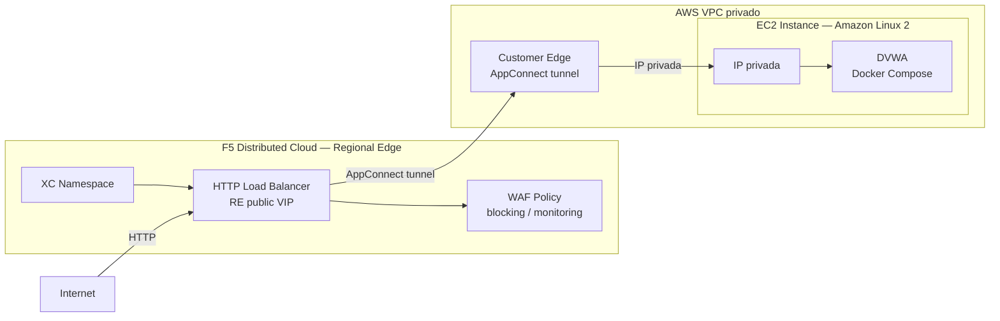

# WAF en RE + AppConnect AWS - Deploy

Este workflow despliega una solución de **Web Application Firewall (WAF) con F5 Distributed Cloud sobre el Regional Edge (RE) y AppConnect**, protegiendo la aplicación **DVWA** (Damn Vulnerable Web Application) que corre en una instancia EC2 dentro de un VPC **privado** en AWS. A diferencia del caso WAF en RE simple, aquí la aplicación **no necesita una IP pública** y se instala un **Customer Edge (CE) en AWS**: el tráfico de internet llega al RE global de F5 XC y se reenvía a la app a través de un túnel cifrado establecido por el CE (AppConnect).

---

## Resumen de arquitectura y caso de uso

### ¿Para qué sirve este laboratorio?

| Capacidad                       | Descripción                                                                                                          |
| ------------------------------- | -------------------------------------------------------------------------------------------------------------------- |
| WAF en Regional Edge            | F5 XC inspecciona el tráfico en el RE global antes de reenviarlo a la aplicación.                                   |
| AppConnect (CE en AWS)          | Un Customer Edge desplegado en AWS crea un túnel cifrado que conecta el RE con la app en la subred privada.          |
| Aplicación sin IP pública       | La instancia EC2 con DVWA no requiere Elastic IP ni puertos abiertos al exterior.                                   |
| Aplicación en EC2               | DVWA corre en una instancia EC2 Amazon Linux 2 (vía `dvwa_userdata.sh`).                                            |
| CE (Customer Edge) en AWS       | Se despliega un CE de F5 XC en AWS que establece el túnel AppConnect entre el RE y la subred privada.               |
| Modo blocking configurable      | La WAF policy puede operar en modo bloqueo o detección, controlado por la variable `XC_WAF_BLOCKING`.               |
| Infraestructura efímera         | Todo se provisiona desde cero con Terraform y se destruye con el workflow de destroy.                               |
| Estado remoto compartido        | Los tres workspaces de TFC comparten estado remoto para pasar outputs (IP del EC2, puerto) entre módulos.           |

### Arquitectura conceptual

```
Internet
   │
   │  HTTP request
   ▼
┌─────────────────────────────────────────────────────────┐
│          F5 Distributed Cloud — Regional Edge (RE)       │
│                                                          │
│  • WAF inspection (block/detect mode)                   │
│  • HTTP Load Balancer                                   │
│  • Origin Pool → CE AppConnect tunnel                   │
└─────────────────────────────────────────────────────────┘
                           │
                           │  AppConnect tunnel (cifrado)
                           ▼
┌─────────────────────────────────────────────────────────┐
│                      AWS VPC (privado)                   │
│                                                          │
│  ┌──────────────────────┐                               │
│  │  Customer Edge (CE)  │  ← conectado al RE via tunnel │
│  └──────────────────────┘                               │
│             │                                            │
│             │  IP privada                                │
│             ▼                                            │
│  ┌──────────────────────────────────────────────────┐   │
│  │  EC2 Instance (Amazon Linux 2) — sin IP pública  │   │
│  │                                                  │   │
│  │  DVWA (dvwa_userdata.sh)                         │   │
│  └──────────────────────────────────────────────────┘   │
└─────────────────────────────────────────────────────────┘
```

### Casos de Uso para Laboratorio

1. Demostración de WAF en RE con AppConnect para aplicaciones en subredes privadas de AWS.
2. Laboratorio de protección de apps en EC2 privado — sin necesidad de exponer IPs públicas ni instalar agentes en la VM.
3. Validación de políticas WAF de F5 XC (bloqueo de SQLi, XSS, ataques OWASP Top 10) con conectividad AppConnect.
4. Entorno de pruebas efímero para workshops y capacitaciones de F5 Distributed Cloud (RE + AppConnect + CE en AWS).
5. Comparación de modelos de publicación: RE con IP pública (caso 4) vs. RE + CE AppConnect en AWS (caso 5).

### Casos de Uso Reales

1. **Protección de aplicaciones internas sin exposición directa a internet.** El patrón más común en producción: aplicaciones en subredes privadas de AWS (sin Elastic IP, sin ALB público) que necesitan ser consumidas desde internet de forma segura. El CE en AppConnect mode actúa como proxy hacia la subred privada — la aplicación nunca ve tráfico de internet directamente. Aplica a ERPs, CRMs, portales internos y paneles de administración.

2. **Migración de WAF on-prem a nube sin mover la aplicación.** Organizaciones con aplicaciones legacy en EC2 (o en data centers conectados vía VPN/Direct Connect) que quieren añadir una capa WAF sin rediseñar la red ni instalar agentes en la VM. El CE se despliega en una subred accesible, establece el túnel con el RE de F5 XC, y la VM sigue en su subred privada sin modificaciones.

3. **WAF centralizado para cargas de trabajo en múltiples VPCs o cuentas AWS.** Empresas con aplicaciones distribuidas en múltiples VPCs o cuentas AWS que quieren un único punto de inspección WAF. El RE global de F5 XC actúa como WAF centralizado para múltiples CEs (uno por VPC/cuenta), sin necesidad de replicar políticas en cada entorno independiente.

4. **Publicación segura de herramientas internas de desarrollo y operaciones.** Jenkins, Grafana, SonarQube, Portainer — herramientas que necesitan ser accesibles desde internet para equipos remotos pero que nunca deben exponerse con IP pública. El CE + RE de F5 XC resuelve este caso sin requerir VPN por usuario ni abrir puertos en los Security Groups.

5. **Cumplimiento de requisitos de segmentación de red (PCI-DSS, HIPAA, ISO 27001).** Marcos regulatorios que exigen que los sistemas de procesamiento de datos sensibles no tengan conexión directa a internet. La arquitectura RE + CE AppConnect cumple el requisito: la subred privada de la VM nunca tiene ruta directa al exterior, y todo el tráfico pasa por el plano de control de F5 XC con log de auditoría completo.

6. **WAF para aplicaciones en instancias spot o efímeras sin IP fija.** Aplicaciones en EC2 Spot Instances o entornos con IPs privadas que cambian frecuentemente. El Origin Pool de F5 XC se actualiza dinámicamente vía Terraform y la IP pública de la app nunca existe — elimina la complejidad de gestionar certificados y DNS asociados a IPs cambiantes.

7. **Sandbox de Red Team / Blue Team con WAF activo en entorno controlado.** Equipos de seguridad que necesitan un entorno con vulnerabilidades conocidas (DVWA) pero con WAF real bloqueando técnicas automáticas, sin exponer el entorno al internet abierto. Valida en condiciones reales que las defensas funcionan antes de activarlas en producción.

### Componentes desplegados

```
waf-re-ac-aws/infra  ──►  VPC + Subnet privada + Internet Gateway + Security Groups
        │
        ▼
waf-re-ac-aws/vm     ──►  EC2 (DVWA) + CE (Customer Edge) en AWS + Key Pair SSH
        │
        ▼
waf-re-ac-aws/xc     ──►  XC Namespace + CE Site + Origin Pool (via CE) + HTTP LB + WAF Policy (RE)
```

---

## Objetivo del workflow

1. Crear (o verificar) los tres workspaces de Terraform Cloud con modo de ejecución `local` y Remote State Sharing habilitado entre ellos.
2. Aprovisionar la infraestructura de red en AWS: VPC, subred, Internet Gateway, Route Table y Security Groups.
3. Desplegar la instancia EC2 con la aplicación **DVWA** (via `dvwa_userdata.sh`) y el **CE (Customer Edge)** de F5 XC en AWS.
4. Configurar en F5 Distributed Cloud el namespace, el CE site, la WAF policy, el Origin Pool (apuntando a la IP privada de la EC2 vía CE) y el HTTP Load Balancer publicado en el **Regional Edge**.

---

## Triggers

```yaml
on:
  workflow_dispatch:
```

- **`workflow_dispatch`:** ejecución manual desde la pestaña **Actions** de GitHub.

---

## Secretos requeridos

Configurar en **Settings → Secrets and variables → Secrets**:

### Terraform Cloud

| Secreto                 | Descripción                                  |
| ----------------------- | -------------------------------------------- |
| `TF_API_TOKEN`          | Token de API de Terraform Cloud              |
| `TF_CLOUD_ORGANIZATION` | Nombre de la organización en Terraform Cloud |

### AWS

| Secreto            | Descripción                              |
| ------------------ | ---------------------------------------- |
| `AWS_ACCESS_KEY`   | Access Key ID de la cuenta AWS           |
| `AWS_SECRET_KEY`   | Secret Access Key de la cuenta AWS       |

### F5 Distributed Cloud

| Secreto           | Descripción                                                             |
| ----------------- | ----------------------------------------------------------------------- |
| `XC_API_URL`      | URL de la API de F5 XC (`https://<tenant>.console.ves.volterra.io/api`) |
| `XC_P12_PASSWORD` | Contraseña del certificado `.p12` de F5 XC                              |
| `XC_API_P12_FILE` | Certificado API de F5 XC en formato `.p12` codificado en **base64**     |

### SSH

| Secreto           | Descripción                                                                                          |
| ----------------- | ---------------------------------------------------------------------------------------------------- |
| `SSH_PRIVATE_KEY` | Llave privada SSH (la pública se deriva en runtime con `ssh-keygen -y`). Usada en el EC2 Key Pair.  |

---

## Variables requeridas

Configurar en **Settings → Secrets and variables → Variables**:

### Terraform Cloud — Workspaces

| Variable                        | Ejemplo                    | Descripción                                        |
| ------------------------------- | -------------------------- | -------------------------------------------------- |
| `TF_CLOUD_WORKSPACE_AWS_INFRA`  | `waf-re-ac-aws-infra`      | Nombre del workspace de TFC para AWS Infra         |
| `TF_CLOUD_WORKSPACE_AWS_VM`     | `waf-re-ac-aws-vm`         | Nombre del workspace de TFC para la VM (EC2 + CE)  |
| `TF_CLOUD_WORKSPACE_AWS_XC`     | `waf-re-ac-aws-xc`         | Nombre del workspace de TFC para F5 XC             |

### Infraestructura

| Variable         | Ejemplo      | Descripción                                         |
| ---------------- | ------------ | --------------------------------------------------- |
| `AWS_REGION`     | `us-east-1`  | Región de AWS donde se despliegan los recursos      |

### Aplicación y F5 XC

| Variable           | Ejemplo                          | Descripción                                                 |
| ------------------ | -------------------------------- | ----------------------------------------------------------- |
| `XC_NAMESPACE`     | `dvwa-prod`                      | Namespace de F5 XC donde se crea el LB y WAF               |
| `DVWA_DOMAIN`      | `dvwa.example.com`               | FQDN de la aplicación en el HTTP LB de F5 XC               |

---

## Jobs principales

### `terraform_infra` — AWS Infra

- **Módulo:** `waf-re-ac-aws/infra`
- **Workspace TFC:** `TF_CLOUD_WORKSPACE_AWS_INFRA`
- **Qué crea:**
  - VPC con DNS habilitado.
  - Internet Gateway y Route Table.
  - Subredes (pública para el CE, privada para la EC2).
  - Security Groups con reglas para tráfico HTTP/HTTPS interno y acceso SSH.
- **Outputs:** IDs de VPC, subredes y SGs (consumidos por `terraform_vm` vía estado remoto).

### `terraform_vm` — AWS VM + CE

- **Módulo:** `waf-re-ac-aws/vm`
- **Workspace TFC:** `TF_CLOUD_WORKSPACE_AWS_VM`
- **Depende de:** `terraform_infra`
- **Qué crea:**
  - Key Pair SSH (public key derivada en runtime desde `SSH_PRIVATE_KEY` con `ssh-keygen -y`).
  - Instancia EC2 Amazon Linux 2 con `dvwa_userdata.sh` para instalar y levantar DVWA.
  - CE (Customer Edge) de F5 XC instalado en AWS que establece el túnel AppConnect hacia el RE.
- **Nota:** usa estado remoto de `waf-re-ac-aws/infra` para obtener IDs de subred y SG.
- **Outputs:** IP privada del EC2 y configuración del CE (consumidos por `terraform_xc`).

### `terraform_xc` — F5XC WAF + AppConnect

- **Módulo:** `waf-re-ac-aws/xc`
- **Workspace TFC:** `TF_CLOUD_WORKSPACE_AWS_XC`
- **Depende de:** `terraform_vm`
- **Qué crea / configura:**
  - Namespace de F5 XC.
  - Registro y configuración del CE site de AWS.
  - WAF Policy (`volterra_app_firewall`) en modo configurable (blocking/monitoring).
  - Origin Pool apuntando a la **IP privada** de la EC2 a través del CE site (AppConnect).
  - HTTP Load Balancer publicado en el Regional Edge.
- **Parámetros relevantes:**

  | Variable Terraform                | Origen                             | Propósito                                            |
  | --------------------------------- | ---------------------------------- | ---------------------------------------------------- |
  | `TF_VAR_tf_cloud_workspace_infra` | `TF_CLOUD_WORKSPACE_AWS_INFRA`     | Estado remoto de infra (VPC/subnet IDs)              |
  | `TF_VAR_tf_cloud_workspace_vm`    | `TF_CLOUD_WORKSPACE_AWS_VM`        | Estado remoto de VM (IP privada EC2, CE config)      |
  | `TF_VAR_aws_access_key`           | `AWS_ACCESS_KEY` (secret)          | Credenciales AWS para el CE site                     |
  | `TF_VAR_aws_secret_key`           | `AWS_SECRET_KEY` (secret)          | Credenciales AWS para el CE site                     |
  | `TF_VAR_xc_namespace`             | `XC_NAMESPACE` (var)               | Namespace de F5 XC                                   |
  | `TF_VAR_app_domain`               | `DVWA_DOMAIN` (var)                | FQDN del HTTP LB                                     |

---

## Arquitectura desplegada por el workflow



---

## Troubleshooting rápido

- **Error al decodificar el P12 (`exit code 58`):**
  Confirmar que `XC_API_P12_FILE` esté codificado en base64 correctamente:

  ```bash
  base64 -i api.p12 | pbcopy   # macOS
  base64 api.p12 | xclip       # Linux
  ```

- **CE site no aparece como `ONLINE` en XC:**
  Los CE sites pueden tardar **15-20 minutos** en registrarse y aparecer en línea. Verificar el estado en la consola de F5 XC → **Infrastructure → Sites**.

- **DVWA no responde desde el Origin Pool:**
  La app DVWA corre via `dvwa_userdata.sh` al lanzar la EC2. Puede tardar 2-3 minutos. Verificar con:

  ```bash
  ssh -i <private_key> ec2-user@<IP> "sudo cat /var/log/cloud-init-output.log"
  ```

- **Workspace TFC no encontrado durante `terraform init`:**
  Verificar que `TF_CLOUD_WORKSPACE_AWS_INFRA`, `TF_CLOUD_WORKSPACE_AWS_VM` y `TF_CLOUD_WORKSPACE_AWS_XC` estén configuradas correctamente y que `TF_API_TOKEN` tenga permisos sobre la organización.

- **Plan fallido en `terraform_xc` por estado remoto vacío:**
  El job `terraform_xc` depende de los outputs de los dos jobs anteriores. Si alguno no tiene estado, re-ejecutar el workflow completo.

- **HTTP 503 en `DVWA_DOMAIN` justo después del apply:**
  El CE site requiere entre **10 y 15 minutos adicionales** para arrancar la EC2, registrarse con F5 XC y descargar la configuración. Verificar el estado en la consola de F5 XC → **Infrastructure → Sites**. Mientras el site aparezca como `Provisioning`, cualquier petición al LB devolverá 503. Esperar hasta que muestre `ONLINE` antes de probar el dominio.

- **Error 409 al crear el namespace en re-ejecuciones:**
  El step _"Create XC Namespace if not exists"_ usa `curl` para pre-crear el namespace `democasos` antes del `terraform apply`. Si el namespace ya existe, el API responde 409 — este código se acepta como éxito y el workflow continúa sin error. Terraform ya no gestiona el recurso `volterra_namespace`, por lo que no fallará por conflicto de estado.

- **El step `Remove namespace from TF state` muestra "Invalid target address":**
  En la primera ejecución limpia, el recurso `volterra_namespace.this` no existe en el estado de TFC, y `terraform state rm` finaliza con código 1. Esto es comportamiento esperado; el `|| true` absorbe el error y el workflow continúa normalmente. Puede ignorarse de forma segura.

- **Variable `DVWA_DOMAIN` no configurada:**
  Debe existir como variable de repositorio en GitHub → **Settings → Secrets and variables → Variables**. Valor de ejemplo: `dvwa.digitalvs.com`. Si no está definida, el step de Terraform fallará con variable vacía.

---

## Ejecución manual

**Archivo de workflow:** `.github/workflows/waf-re-ac-aws-vm-apply.yml`

1. Ir a **Actions** en GitHub.
2. Seleccionar el workflow: **WAF en RE + AppConnect AWS - Deploy**.
3. Hacer clic en **Run workflow**.
4. Confirmar la ejecución. No hay inputs adicionales.

### Criterios de éxito

- Los tres jobs (`terraform_infra`, `terraform_vm`, `terraform_xc`) terminan en estado `success`.
- El CE site aparece como `ONLINE` en la consola de F5 XC → **Infrastructure → Sites**.
- El HTTP Load Balancer está publicado en el Regional Edge.
- La aplicación DVWA es accesible desde internet a través del dominio configurado en `DVWA_DOMAIN`.

---

## Uso de la aplicación DVWA

### Acceso inicial

1. Abrir el navegador y navegar a `http://<DVWA_DOMAIN>/setup.php`.
2. Hacer clic en **Create / Reset Database** para inicializar la base de datos con los usuarios y datos de prueba por defecto.
3. Tras la inicialización, la página redirige automáticamente al login.

### Credenciales por defecto

| Usuario  | Contraseña |
| -------- | ---------- |
| `admin`  | `password` |
| `gordonb`| `abc123`   |
| `1337`   | `charley`  |
| `pablo`  | `letmein`  |
| `smithy` | `password` |

### Configuración del nivel de seguridad

Después de hacer login, ir a **DVWA Security** en el menú lateral y seleccionar el nivel:

| Nivel       | Descripción                                                                                          |
| ----------- | ---------------------------------------------------------------------------------------------------- |
| `Low`       | Sin protección en la app — ideal para generar ataques y validar que el WAF de F5 XC los bloquea.    |
| `Medium`    | Protección parcial en la app — útil para comparar detección WAF vs. filtros de la propia app.       |
| `High`      | Protección casi completa en la app — foco en técnicas avanzadas de bypass.                          |
| `Impossible`| App completamente protegida — referencia de código seguro.                                           |

> Para este laboratorio se recomienda usar **`Low`** para que el WAF de F5 XC actúe como única línea de defensa.

### Módulos disponibles

| Módulo                   | Tipo de ataque                       | Cómo probar con el WAF                                           |
| ------------------------ | ------------------------------------ | ---------------------------------------------------------------- |
| **SQL Injection**        | SQLi clásico                         | Ingresar `' OR '1'='1` en el campo `User ID`                    |
| **SQL Injection (Blind)**| SQLi ciego (boolean/time-based)      | Ingresar `1' AND SLEEP(5)#`                                      |
| **XSS (Reflected)**      | Cross-Site Scripting reflejado       | Ingresar `<script>alert('xss')</script>` en el campo de nombre  |
| **XSS (Stored)**         | XSS persistente                      | Publicar un comentario con `<script>alert(1)</script>`           |
| **Command Injection**    | Inyección de comandos OS             | Ingresar `127.0.0.1; id` en el campo de IP                      |
| **File Inclusion**       | LFI/RFI                              | Modificar el parámetro `page=` con rutas del sistema            |
| **File Upload**          | Subida de archivos maliciosos        | Intentar subir un `.php` o `.php.jpg`                            |
| **CSRF**                 | Cross-Site Request Forgery           | Usar el formulario de cambio de contraseña                       |
| **Brute Force**          | Fuerza bruta en login                | Probar combinaciones de usuario/contraseña por formulario        |

### Verificación del WAF

Con la WAF policy de F5 XC en **modo blocking**, los ataques deben ser **bloqueados** y el cliente recibe una respuesta de bloqueo (por defecto HTTP 200 con página de bloqueo de F5 XC, o configurable a 403).

Ejemplo de prueba rápida con `curl`:

```bash
# SQLi — debe ser bloqueado por el WAF
curl -i "http://<DVWA_DOMAIN>/vulnerabilities/sqli/?id=' OR '1'='1&Submit=Submit" \
  -b "PHPSESSID=<session_id>; security=low"

# XSS reflejado — debe ser bloqueado por el WAF
curl -i "http://<DVWA_DOMAIN>/vulnerabilities/xss_r/?name=<script>alert(1)</script>" \
  -b "PHPSESSID=<session_id>; security=low"

# Command Injection — debe ser bloqueado por el WAF
curl -i "http://<DVWA_DOMAIN>/vulnerabilities/exec/" \
  --data "ip=127.0.0.1;id&Submit=Submit" \
  -b "PHPSESSID=<session_id>; security=low"
```

Para obtener el `PHPSESSID`, hacer login en DVWA desde el navegador y copiar la cookie desde las herramientas de desarrollador (F12 → Application → Cookies).

Los eventos de bloqueo quedan registrados en F5 XC → **Security → Security Events** del namespace correspondiente.

---

## Destroy del laboratorio

El archivo [`.github/workflows/waf-re-ac-aws-vm-destroy.yml`](../.github/workflows/waf-re-ac-aws-vm-destroy.yml) destruye **todos** los recursos creados por el apply en orden inverso.

**Trigger:** `workflow_dispatch` — ejecución manual desde GitHub Actions.

### Orden de destrucción

```
terraform_xc     (1° — elimina LB, WAF policy, CE site config, Origin Pool, namespace XC)
      │
      ▼
terraform_vm     (2° — elimina EC2, CE, Key Pair)
      │
      ▼
terraform_infra  (3° — elimina VPC, subredes, SGs, Internet Gateway)
```
